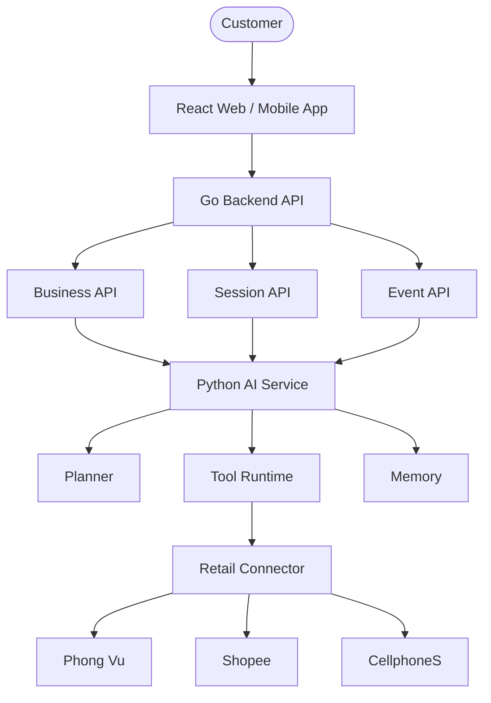

# System Architecture

Version: 1.0

---

# Overview

SHOPWISE adopts a distributed architecture where business services, AI orchestration, and retailer integrations are separated into independent runtime components.

The system is designed around three architectural principles:

- AI-native
- Retail-agnostic
- Service-oriented

---

# Context Diagram

---

# Architectural Principles

## Separation of Concerns

Business logic and AI orchestration are deployed independently.

---

## Retail Independence

No service depends directly on retailer-specific APIs.

---

## Tool-based Integration

AI communicates exclusively through tools.

---

## UI Independence

Frontend owns rendering.

AI owns interaction intent.

---

## Stateless AI Runtime

The AI service is stateless.

Persistent data is managed by backend services.
