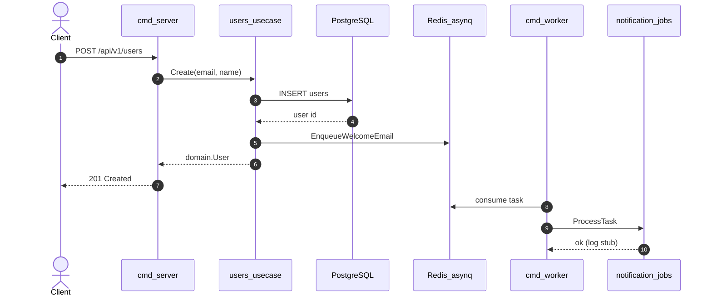

# Business Flow: User create + welcome email

> **Document Version:** 1.0  
> **Created:** 2026-06-14  
> **Status:** Approved  
> **Primary Module:** users  
> **Related Modules:** notification, platform/job

---

## 1. Overview

When a client creates a user, the API persists the record and enqueues a background job to send a welcome email (stub: structured log).

### 1.1 Trigger

`POST /api/v1/users` with JSON body `{ "email", "name" }`.

### 1.2 Postconditions (success)

- User row exists in PostgreSQL
- asynq task `notification:send_welcome_email` is queued in Redis
- HTTP 201 with user JSON returned

---

## 2. Sequence Diagram (happy path)

---

## 3. Error scenarios

| Scenario                          | HTTP               | Code                |
| --------------------------------- | ------------------ | ------------------- |
| Missing email/name                | 400                | `VALIDATION_FAILED` |
| Duplicate email                   | 409                | `CONFLICT`          |
| Invalid UUID on get/update/delete | 400                | `VALIDATION_FAILED` |
| User not found                    | 404                | `NOT_FOUND`         |
| Enqueue failure                   | 201 still returned | logged server-side  |

---

## 4. Domain events (future)

| Event | Emitted when | Consumer |
| --- | --- | --- |
| `users.user.created` | After successful create | notification (welcome email) |

Current implementation uses direct enqueue port instead of event bus (MVP simplicity).

---

## 5. Implementation checklist

- [x] `users/usecase` Create with `WelcomeEmailEnqueuer` port
- [x] `platform/job` asynq client
- [x] `notification/jobs` welcome email handler
- [x] `cmd/worker` serves mux
- [x] Unit tests for usecase, handler, job

---

## Appendix B: Related Documents

- [users-prd.md](./users-prd.md)
- [system-design.md](../system-design.md)
