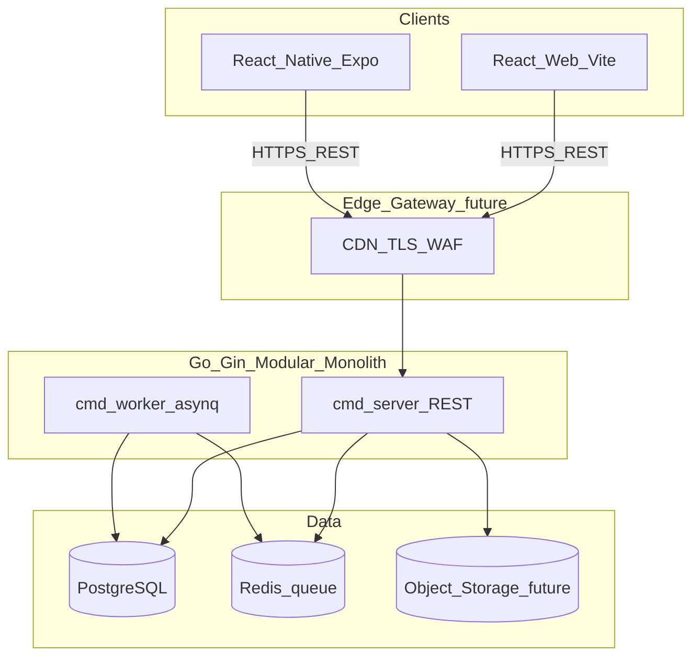
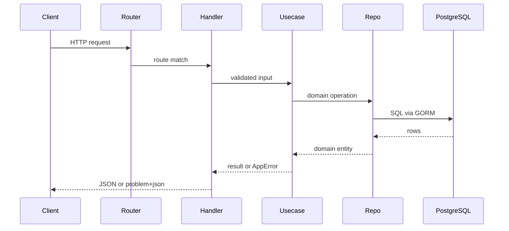
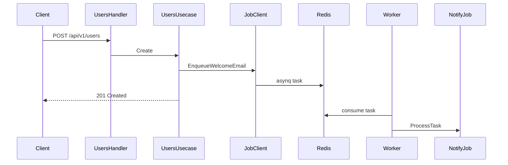

# Server system design

**Version:** 1.0  
**Last Updated:** 2026-06-14  
**Status:** Approved  
**Repository:** [apps/server](https://github.com/quanngynx/shopwise/tree/main/apps/server)

---

## 1. Context (C4 Level 1)



React web and native clients call REST endpoints on the Gin API. Long-running work (email, push, reports) is enqueued to Redis and processed by a separate worker binary.

---

## 2. Containers (C4 Level 2)

| Container      | Responsibility                    | Technology         |
| -------------- | --------------------------------- | ------------------ |
| `cmd/server`   | HTTP API, OpenAPI, module routing | Go, Gin            |
| `cmd/worker`   | Background job consumers          | Go, asynq          |
| PostgreSQL     | Source of truth                   | Postgres 18        |
| Redis          | Job queue + health checks         | Redis 8, asynq     |
| Object storage | Files module (future)             | S3/MinIO port only |

---

## 3. Components (C4 Level 3)

### Shared platform (`internal/platform/`)

| Package      | Role                                     |
| ------------ | ---------------------------------------- |
| `config`     | Environment configuration                |
| `database`   | GORM Postgres connection, metadata seed  |
| `cache`      | Redis client                             |
| `middleware` | CORS, logging, recovery, RFC 7807 errors |
| `health`     | `GET /health`                            |
| `router`     | Composes module routes + Swagger (debug) |
| `job`        | asynq client for enqueue                 |
| `testutil`   | HTTP test helpers                        |

### Bounded modules

| Module           | Route prefix            | Status                   |
| ---------------- | ----------------------- | ------------------------ |
| `identity`       | `/api/v1/identity`      | Scaffold (`GET /status`) |
| `users`          | `/api/v1/users`         | Reference CRUD + OpenAPI |
| `business`       | `/api/v1/business`      | Scaffold                 |
| `files`          | `/api/v1/files`         | Scaffold + `StoragePort` |
| `notification`   | `/api/v1/notifications` | Scaffold + job handlers  |
| `administration` | `/api/v1/admin`         | Scaffold                 |

### Layer rule (every module)

```
handler (HTTP + DTOs) → usecase (business logic) → repository/postgres (GORM)
```

Domain types live in `domain/`. Cross-module contracts use `ports.go` in the **consumer** module.

---

## 4. Synchronous request flow



---

## 5. Async flow (welcome email)



Enqueue failures are logged but do not fail user creation (fire-and-forget for MVP).

---

## 6. Dependency rules

- `platform/` never imports feature modules
- Feature modules never import another module's `repository/`
- `domain/` is stdlib-only (no Gin, GORM, asynq)
- Module migrations run from `cmd/server/main.go` (e.g. `users/repository/postgres.Migrate`)

---

## 7. API documentation

- OpenAPI generated with swaggo into `apps/server/docs/`
- Swagger UI: `http://localhost:18080/swagger/index.html` (debug mode only)
- Regenerate: `pnpm swagger:gen` from `apps/server`

---

## 8. Operations

| Command             | Purpose                             |
| ------------------- | ----------------------------------- |
| `pnpm dev:deps`     | Start Postgres + Redis              |
| `pnpm dev:app`      | Run API locally                     |
| `pnpm dev:worker`   | Run background worker               |
| `docker compose up` | Full stack (server + worker + deps) |

---

## References

- [General_diagram.md](../../General_diagram.md)
- [golang-gin-architect bounded contexts](https://github.com/quanngynx/shopwise/tree/main/.agents/skills/golang-gin-architect)
