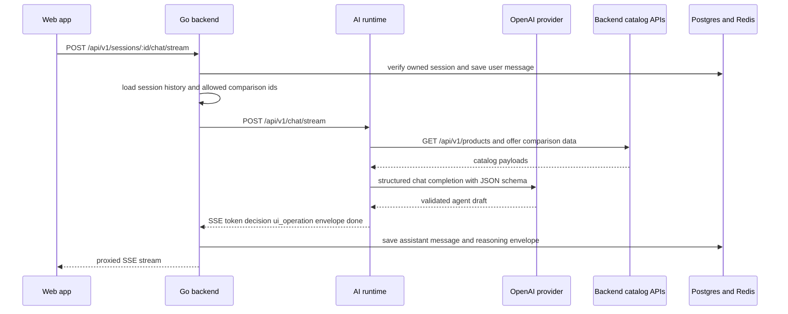

# Architecture Overview

Shopwise runs as a small multi-runtime system inside one monorepo. The important architectural boundary is not the source tree itself, but **which runtime owns which kind of work**:

- the **web app** is the primary interactive client and orchestrates current user-facing flows
- the **mobile app** exists as an Expo shell with shared environment wiring, but it is not the center of the currently wired request paths
- the **Go backend** is the stateful system of record and the main business API
- the **Python AI runtime** is a separate stateless inference service that turns conversation history plus catalog context into validated agent envelopes
- the **shared packages and workspace tooling** make these runtimes build, type-check, and evolve together without merging them into one process

## Runtime ownership and boundaries

### Web app: primary interactive surface

The web app boots from `apps/web/src/main.tsx`. It creates a TanStack Router instance from the generated route tree, creates a shared React Query client, and renders the application inside `StrictMode`, `QueryClientProvider`, a forced-dark `ThemeProvider`, and the shared `FontProvider` from `@shopwise/ui`. The router is configured with intent-based preloading, scroll restoration, and a default pending loader, so navigation and data loading behavior are established at the root bootstrap layer rather than per page.

The root route in `apps/web/src/routes/__root.tsx` adds the global UI shell used by every page: tooltip support, head metadata rendering, the dark theme wrapper, the checkout incentive provider and panel, the shared toast system, and devtools that appear only when `env.VITE_NODE_ENV === "development"`. It also sets shared pending, not-found, and error components.

Current top-level routes show what the product actually exposes today:

- `/` renders the landing page
- `/get-started` renders the onboarding flow
- `/dashboard` is the main agent-assisted shopping workspace
- `/chat` renders a simpler chat workspace
- `/resume` restores a conversation from a secure token and then redirects into the dashboard
- `/auth` is a layout route for auth-related screens

The dashboard route is where the current architecture is most user-visible. It imports decision-memory API helpers such as `fetchGreeting`, `runAgentTurnStream`, and `sendInteractionStream`, then layers workspace-specific UI around those calls. That makes the web app the orchestration layer for the interactive shopping experience, while the backend and AI runtime remain service providers behind it.

### Mobile app: present, shared-workspace client shell

The mobile app is an Expo application whose entrypoint is `expo-router/entry`. Its `package.json` shows native and web-capable Expo scripts plus a dependency on the shared `@shopwise/env` package. This means mobile is part of the same workspace contract as web, but the repository paths inspected for current request wiring do not show it participating in the main conversation, session-resume, or backend bootstrap flows documented here.

In practice, mobile is best understood as a **prepared client surface** rather than the architectural center of the system's present runtime behavior.

### Go backend: stateful modular monolith and source of record

The backend entrypoint in `services/main-backend/cmd/retail/main.go` is intentionally thin. It parses `-migrate` and `-seed` flags, then delegates normal server startup to `bootstrap.Run()`. That makes `services/main-backend/internal/bootstrap/bootstrap.go` the real composition root.

`bootstrap.Run()` performs the backend lifecycle in a fixed order:

1. load configuration
2. create structured logging
3. connect Postgres
4. connect Redis
5. create a Redis-backed job client
6. instantiate repositories and domain services
7. build the Gin router with shared middleware
8. register health and `/api/v1` route groups
9. start the HTTP server
10. wait for `SIGINT` or `SIGTERM`
11. shut down the server and close database, Redis, and job resources

This is a classic **modular monolith**. Domains such as identity, users, orders, decision memory, resume session, promotions, files, accessories, and catalog stay in one deployable Go service, but each domain is wired through distinct repositories, use cases, and handlers.

The backend is also where state ownership lives:

- configuration and HTTP policy are loaded before anything else
- Postgres stores business and session data
- Redis supports cache and job infrastructure
- session ownership is checked before chat turns are processed
- user and anonymous identity are enforced at the backend boundary
- conversation history is persisted before and after AI calls
- resume tokens are validated at the backend, not in the client or AI runtime

The router factory in `internal/platform/router/router.go` reinforces this role. It sets Gin mode, then applies recovery, request logging, CORS, and centralized error handling to the whole engine. Swagger is exposed only in debug mode.

### Python AI runtime: stateless model execution and response shaping

The AI runtime is a separate FastAPI process defined in `services/ai-runtime/src/main.py`. It adds a middleware that times every request, logs path, method, status code, and latency, and writes an `X-Process-Time` header. It also installs a global exception handler that returns a structured `AIErrorState` payload instead of leaking arbitrary exceptions. The app mounts its chat router under `/api/v1` and exposes a simple `/health` endpoint.

The important architectural boundary is that this service does **not** own durable session state. Its settings point back at the Go backend with `backend_url = "http://localhost:18080"`, and its main request models always receive a `session_id` plus prior `messages` from callers.

Inside `src/api/chat.py`, each request constructs dependencies at the edge:

- `OpenAIProvider` encapsulates model calls
- `ToolProxy` calls the Go backend for catalog and offer data
- request payloads are validated with Pydantic models

The core chat path is:

- `POST /api/v1/chat` builds a LangGraph workflow with `create_workflow(...)`
- the workflow first loads catalog and permitted offer-comparison data from the Go backend through `ToolProxy`
- it then prompts the model using structured JSON-schema output requirements
- it validates the raw model result as `AgentDraft`
- it hydrates that draft into an `AgentResponse`
- on validation failure it retries the LLM step up to `MAX_SELF_CORRECTION_RETRIES`
- on backend catalog HTTP failures it returns `502 catalog unavailable`
- if no response is produced it returns `502 invalid model response`

The streaming path, `POST /api/v1/chat/stream`, does not stream raw model deltas yet. It calls the normal chat endpoint, then converts the validated response into SSE events using `generate_agent_sse()`. That generator always emits at least one `token` event, may emit typed decision events such as `recommendation`, `comparison`, `offer_comparison`, or `checkout_ready`, emits any `ui_operation` events, then sends the full validated envelope and a final `done` event.

This keeps the Python service focused on **model interaction, schema validation, and agent response shaping**, not on identity, persistence, or browser-facing session control.

## Main request flow

Main runtime flow for an agent turn: the web app talks to the Go backend, which persists session state and proxies to the AI runtime, while the AI runtime calls back into backend catalog endpoints before invoking the model.

## How the runtimes collaborate

### Web to backend: browser-facing stateful APIs

The web app's `decision-memory.ts` module shows the main client contract. It talks directly to `/api/v1/sessions` for session creation, listing, updates, restore, greeting, chat, and chat streaming. It automatically attaches a bearer token when available and always ensures an `X-Anonymous-ID` header exists, so the backend can associate guest sessions with a stable anonymous identifier.

The `/resume` route uses React Query to call `resumeSessionFromToken(...)`, removes the token from the URL after success, invalidates cached session queries, and then navigates to `/dashboard` with the resumed session ID. This keeps token handling on the web edge thin while leaving token validation and consumption semantics to the backend.

### Backend to AI runtime: persistence first, inference second

`internal/decision_memory/handler/chat.go` makes the ownership split explicit.

For both synchronous and streaming chat:

- the backend parses the session ID
- verifies the caller owns that session
- persists the incoming user message in backend storage
- reloads the full stored session history
- extracts previously allowed comparison product IDs from stored assistant reasoning envelopes
- forwards a normalized payload to the AI runtime

For non-streaming chat, the backend expects a valid JSON envelope back, validates that it contains at least a message, persists the assistant message plus the full envelope as `ReasoningGraph`, and returns the response to the client.

For streaming chat, the backend proxies the AI runtime's SSE stream outward, but it still watches the stream contents. It accumulates token text, remembers typed decision events and the full `envelope` event, and when the `done` event arrives it persists the assistant message plus the final envelope. If persistence fails at that point, it injects an SSE `error` event into the outbound stream.

That means streaming does not bypass backend durability. The client receives a live stream, but the backend still decides whether a completed turn becomes part of durable conversation history.

### AI runtime back into backend: tool boundary, not database boundary

The AI runtime never reaches directly into Postgres or Redis. Instead, `ToolProxy` uses HTTP to call backend APIs:

- `GET /api/v1/products` for the catalog snapshot used in prompting
- `GET /api/v1/products/{product_id}/offer-comparison` for selected offer details

This is a strong architectural boundary:

- the backend remains the owner of business data and catalog contracts
- the AI runtime consumes backend-owned HTTP interfaces as tools
- model prompts are built from backend-served data, not from duplicated stores inside Python

## Shared layers that connect the runtimes

### Shared packages

The most important shared package layers visible from current wiring are:

- `@shopwise/ui`, which exports reusable components, hooks, contexts, styles, and the `FontProvider` used by the web app root
- `@shopwise/env`, which exports separate `./web` and `./mobile` environment entrypoints so both clients share validation patterns while keeping platform-specific env surfaces
- `@shopwise/protocols`, which provides shared TypeScript protocol exports consumed by client code such as dashboard interaction requests

The repository also contains `packages/api-types`, `packages/generated`, `packages/schemas`, `packages/sdk`, `packages/types`, and `packages/ui-protocol`, which indicates the monorepo is designed to centralize cross-runtime contracts even when some individual packages are currently thin.

### Workspace and task orchestration

At the repository root, `pnpm-workspace.yaml` includes `apps/*`, `packages/*`, `services/*`, `conformance/*`, `deploy`, `infra`, and `scripts`. Root `package.json` uses `pnpm@11.9.0`, and the main developer commands delegate to Turbo: `dev`, `build`, `check-types`, and filtered commands for web, mobile, and server development.

`turbo.json` defines shared task behavior:

- `build` depends on upstream builds and tracks `.env*` as inputs
- `dev` is persistent and uncached
- `deploy` and `destroy` are intentionally uncached

That tooling layer matters architecturally because it allows four different runtime stacks to remain in one repository without pretending they are one application binary.

## Operational lifecycle and failure semantics

### Backend startup and shutdown invariants

The backend cannot fully start unless configuration, Postgres, Redis, and the job client initialize successfully. Its health endpoint reports database and Redis status separately and returns `503` with overall status `degraded` if either dependency is unhealthy.

At shutdown, the backend waits for `SIGINT` or `SIGTERM`, then attempts a bounded graceful shutdown before closing the database, Redis client, and job client. This confirms that the Go service is the longest-lived operational anchor in the system.

### AI runtime failure handling

The AI runtime handles failure at several layers:

- OpenAI calls are retried with exponential backoff for connection, rate-limit, and generic API errors
- invalid model JSON is not returned immediately; the workflow retries the LLM step with validation feedback
- backend catalog HTTP failures become `502` errors
- unhandled FastAPI exceptions become structured `500` JSON responses
- streaming wraps downstream failures into SSE `error` and `done` events

The result is a service that prefers validated envelopes or explicit structured failures, rather than partially trusted model output.

## Architectural guidance for changes

- Start system-composition changes in `services/main-backend/internal/bootstrap/bootstrap.go`; that file defines what really exists at runtime.
- Treat the Go backend as the default owner for persistent state, identity, and business-side policy.
- Treat the AI runtime as a replaceable stateless worker that depends on backend HTTP tools and strict response schemas.
- Put new browser-wide providers or navigation policy in the web root bootstrap layers, not ad hoc inside feature routes.
- Assume the mobile app shares workspace contracts and env conventions, but verify actual route or API wiring before documenting it as a first-class flow participant.
