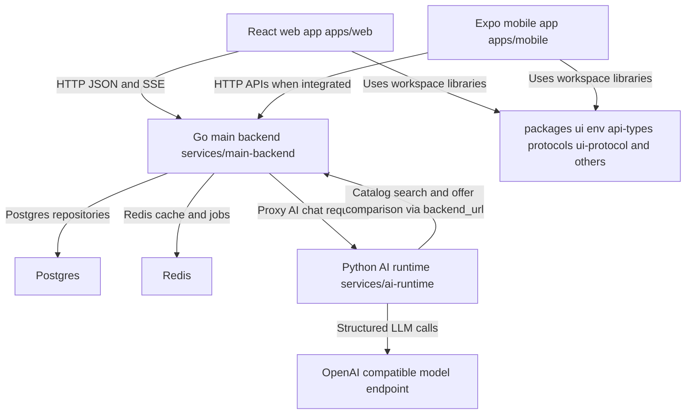
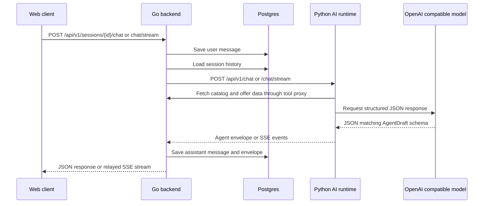

## What this repository is

SHOPWISE is a single monorepo that hosts multiple runtimes for one retail platform:

- a **React web app** in `apps/web`
- an **Expo mobile app** in `apps/mobile`
- a **Go main backend** in `services/main-backend`
- a **Python AI runtime** in `services/ai-runtime`
- **shared packages** in `packages/*`
- **deployment and infrastructure surfaces** in `deploy/` and `infra/`

The root workspace is coordinated by `pnpm` and `turbo`. The root `package.json` defines cross-repo development and build scripts such as `dev`, `build`, `dev:web`, and `dev:server`, while `pnpm-workspace.yaml` brings `apps`, `packages`, `services`, `conformance`, `deploy`, `infra`, and `scripts` into the same workspace. This means the repository is organized as one source tree with several deployable runtimes and some internal libraries shared between them.

## Runtime and request topology

```mermaid
flowchart TD
    Web["React web app apps/web"] -->|HTTP JSON and SSE| Backend["Go main backend services/main-backend"]
    Mobile["Expo mobile app apps/mobile"] -->|HTTP APIs when integrated| Backend
    Backend -->|Postgres repositories| Postgres["Postgres"]
    Backend -->|Redis cache and jobs| Redis["Redis"]
    Backend -->|Proxy AI chat requests| AIRuntime["Python AI runtime services/ai-runtime"]
    AIRuntime -->|Catalog search and offer comparison via backend_url| Backend
    AIRuntime -->|Structured LLM calls| OpenAI["OpenAI compatible model endpoint"]
    Web -->|Uses workspace libraries| Shared["packages ui env api-types protocols ui-protocol and others"]
    Mobile -->|Uses workspace libraries| Shared
```

This diagram shows the deployed runtimes and the main request relationships between them.

A key architectural rule in the current codebase is that **the Go backend remains the stateful system of record**, while the Python AI runtime is a separate model-serving process. In particular, AI conversations are not stored in the Python service. The backend saves user and assistant messages itself, then proxies chat requests to the AI runtime.

## Monorepo composition

### Frontend applications

#### Web app

The web runtime is the most fully wired client application in the repository. Its package depends on React, TanStack Router, React Query, `@shopwise/ui`, `@shopwise/env`, `@shopwise/api-types`, and `@shopwise/protocols`, showing that it consumes both platform libraries and app-specific contract packages.

Its entrypoint in `apps/web/src/main.tsx` creates a single `QueryClient`, creates the TanStack router from the generated route tree, enables intent-based preloading and scroll restoration, and renders the app inside `QueryClientProvider`, `ThemeProvider`, and `FontProvider`. That file is the real web bootstrap point, so changes to global client behavior belong there before they belong in route-level code.

#### Mobile app

The mobile runtime is an Expo Router app. `apps/mobile/package.json` declares `expo-router/entry` as its main entrypoint and includes Expo, React Native, secure storage, gesture handling, keyboard controller, and HeroUI Native dependencies.

Its root layout in `apps/mobile/app/_layout.tsx` wraps the app in `GestureHandlerRootView`, `KeyboardProvider`, `AppThemeProvider`, and `HeroUINativeProvider`, then mounts a `Stack` navigator whose initial route is the drawer flow. The tab layout under `apps/mobile/app/(drawer)/(tabs)/_layout.tsx` shows that the current mobile shell is organized around drawer and tab navigation rather than a thin web wrapper.

### Backend services

#### Go main backend

The main backend is a modular Go service whose composition is centered in `services/main-backend/internal/bootstrap/bootstrap.go`. This is the most authoritative architecture file in the repo because it loads configuration, opens infrastructure connections, constructs repositories and use cases, wires handlers, registers routes, and owns lifecycle management.

At startup it:

- loads environment-backed config
- creates a structured logger
- connects to **Postgres**
- connects to **Redis**
- creates a Redis-backed **job client**
- constructs repositories and use cases for users, identity, orders, decision memory, resume sessions, accessories, and promotions
- creates the Gin router and registers `/health` plus `/api/v1/*` routes
- starts the HTTP server with read, write, and idle timeouts
- waits for `SIGINT` or `SIGTERM`
- shuts down the HTTP server gracefully, then closes database, Redis, and job connections

The same bootstrap package also owns migration and seed entrypoints. `Migrate()` runs migrations for users, identity, orders, decision memory, accessories, resume sessions, and promotions, while `Seed()` ensures startup metadata exists. That makes the bootstrap package not only the runtime composition root, but also the operational composition root for schema lifecycle.

#### Python AI runtime

The AI runtime is a separate FastAPI service. `services/ai-runtime/src/main.py` creates the app, adds an HTTP middleware that logs path, method, status code, and latency while adding an `X-Process-Time` header, installs a global exception handler that returns a normalized internal error payload, mounts the chat router at `/api/v1`, and exposes `/health`.

Its settings in `services/ai-runtime/src/core/config.py` show the process boundary explicitly:

- it has its own host and port, defaulting to `0.0.0.0:8000`
- it requires an OpenAI API key
- it keeps a `backend_url`, defaulting to `http://localhost:18080`

That `backend_url` is important because the AI runtime is not isolated from business data; instead, it reaches back into the Go backend for catalog and offer data through a tool proxy.

## How the services collaborate

```mermaid
sequenceDiagram
    participant Web as Web client
    participant Go as Go backend
    participant DB as Postgres
    participant AI as Python AI runtime
    participant LLM as OpenAI compatible model

    Web->>Go: POST /api/v1/sessions/{id}/chat or chat/stream
    Go->>DB: Save user message
    Go->>DB: Load session history
    Go->>AI: POST /api/v1/chat or /chat/stream
    AI->>Go: Fetch catalog and offer data through tool proxy
    AI->>LLM: Request structured JSON response
    LLM-->>AI: JSON matching AgentDraft schema
    AI-->>Go: Agent envelope or SSE events
    Go->>DB: Save assistant message and envelope
    Go-->>Web: JSON response or relayed SSE stream
```

This diagram shows the most important cross-runtime request path in the repository.

### Backend-owned conversation persistence with AI proxying

The clearest architecture boundary is implemented in `services/main-backend/internal/decision_memory/handler/chat.go`.

For both synchronous chat and streaming chat, the backend handler:

1. validates the session id and request body
2. verifies the caller owns the session
3. writes the **user message** into backend storage before calling AI
4. reloads the full saved session history from the backend repository
5. converts persisted user and assistant messages into the AI runtime request payload
6. includes `allowed_comparison_ids` derived from previously stored assistant envelopes
7. sends the request to the AI runtime
8. returns the AI response to the client
9. persists the **assistant message** itself, storing both plain message text and the full AI envelope as `ReasoningGraph`

For SSE streaming, the backend does more than pass bytes through. It scans the AI runtime's SSE stream, accumulates tokens and decision events, forwards blocks to the client, and on the `done` event persists the assistant reply. If the runtime included a full `envelope` event, that exact envelope is stored; otherwise the backend reconstructs a minimal envelope from the streamed message and decision payload before saving it.

The result is a strong ownership split:

- **Go backend owns session identity, authorization checks, chat history, and persisted AI output**
- **Python AI runtime owns model invocation, schema validation, and dynamic decision generation**

### AI runtime control flow

The FastAPI router in `services/ai-runtime/src/api/chat.py` exposes three main behaviors:

- `POST /api/v1/greeting` generates a greeting with LLM fallback to a local canned message
- `POST /api/v1/chat` runs the main agent workflow and returns a typed `AgentResponse`
- `POST /api/v1/chat/stream` wraps the non-streaming chat result into SSE events for token, decision, UI operations, envelope, and done markers

The chat endpoint constructs a workflow with `create_workflow`, passes in the conversation messages, session id, retry count, and allowed comparison ids, and converts transport or validation failures into HTTP errors.

Inside `services/ai-runtime/src/graph/workflow.py`, the workflow has two major nodes:

- `load_catalog`, which calls the tool proxy to fetch catalog data and any available offer comparisons for allowed product ids
- `invoke_llm`, which builds a system prompt from catalog data, allowed comparison ids, and offer data, then requests JSON-schema-constrained output from the LLM provider

If the returned JSON does not validate against the required schema, the workflow records the validation error and retries the LLM step up to a bounded maximum of two self-correction retries. This makes schema repair part of the runtime's control flow rather than a client responsibility.

### Structured response protocol

`services/ai-runtime/src/models/schemas.py` defines the output contract that drives both machine validation and UI behavior. The AI runtime distinguishes between `question`, `recommendation`, `comparison`, `offer_comparison`, and `checkout_ready` responses. It also hydrates these drafts into richer responses containing decision objects, conversation state, and UI operations such as `append` or `replace` on a target surface.

This matters architecturally because the AI runtime is not only returning text. It is returning a structured response envelope intended to drive commerce-oriented interaction surfaces.

## Main backend domains exposed at runtime

The bootstrap route registration shows the current API surface groups under `/api/v1`:

- `identity`
- `users`
- `checkout`
- `orders`
- `files`
- `products`
- `accessories`
- `stores`
- `sessions`
- `session`
- promotion routes on the `v1` router
- `admin`

These groups are not just naming conventions; they correspond to independently wired handler and use case stacks. The backend is therefore best understood as a **modular monolith**: one deployable service with multiple domain modules and shared platform infrastructure.

## Shared packages and protocol surfaces

The shared packages are not all equal in architectural importance, but several define the boundaries between runtimes:

- `@shopwise/env` exports separate `./web` and `./mobile` environment entrypoints, indicating runtime-specific environment validation from a common package.
- `@shopwise/ui` exports shared styles, components, hooks, contexts, and postcss config for frontend reuse.
- `@shopwise/api-types` exports TypeScript API contract modules such as the root index, `identity`, and `promotions`.
- `@shopwise/protocols` exposes a shared source entrypoint for protocol definitions.
- `@shopwise/ui-protocol` exports JSON schemas and TypeScript types under `schemas/*` and `types/*`, which fits the AI runtime's structured UI response model.

Together, these packages show that the monorepo is not only colocating applications. It is also using internal packages to stabilize contracts, UI primitives, and environment handling across runtimes.

## Configuration and operational boundaries

### Go backend configuration

`services/main-backend/internal/platform/config/config.go` shows the backend's key operational dependencies and defaults:

- HTTP port defaults to `18080`
- web app URL defaults to `http://localhost:3001`
- AI runtime URL defaults to `http://localhost:8000`
- Postgres, Redis, and JWT secret are required for startup
- checkout auth bypass is only effective when enabled and running in debug mode
- a feature flag controls the Phong Vu connector

Because `Load()` refuses startup without database, Redis, and JWT configuration, the backend should be treated as a stateful service with mandatory infrastructure dependencies, not as a standalone stateless API.

### AI runtime configuration

The AI runtime has a lighter configuration surface. It requires an OpenAI API key, defaults to port `8000`, and points to the backend through `backend_url`. Operationally, this means the AI runtime can start without Postgres or Redis of its own, but it still depends on backend reachability for tool-backed catalog and offer retrieval.

### Deployment surfaces

The repository includes `deploy/` and `infra/` workspace members, but the inspected deployment files are currently thin. `deploy/package.json` and `infra/package.json` mainly establish those directories as workspace packages, and the checked-in `infra/docker-compose.yml` is currently empty. The root README still describes Cloudflare deployment for the web and Docker-oriented backend development, but the strongest architecture evidence in the repository today is the runtime bootstrap and package wiring rather than mature checked-in deployment definitions.

## Architectural invariants and safe-change guidance

When changing this system, the following invariants matter:

- **Conversation history belongs to the Go backend.** Do not move persistence assumptions into Python process memory.
- **AI requests are backend-mediated.** Web clients should treat the backend as the durable boundary even when an interaction is AI-driven.
- **Bootstrap is the source of truth for live backend composition.** If you need to know what domains, dependencies, and routes are active, inspect `internal/bootstrap/bootstrap.go` first.
- **AI output is schema-governed.** Changes to agent response types or UI operations require coordinated updates across the AI runtime schemas and whichever frontend consumers render them.
- **The AI runtime depends on backend tools for commerce context.** Catalog and offer access are part of runtime execution, not preprocessing done entirely on the client.

In practice:

- start backend composition work in `services/main-backend/internal/bootstrap/bootstrap.go`
- start AI request-flow work in `services/main-backend/internal/decision_memory/handler/chat.go`
- start agent contract work in `services/ai-runtime/src/models/schemas.py` and `services/ai-runtime/src/api/chat.py`
- start client-shell work in `apps/web/src/main.tsx` or `apps/mobile/app/_layout.tsx`

## Summary

The repository implements one retail platform through several cooperating runtimes rather than one universal application process. The web and mobile apps are client shells, the Go backend is the stateful retail core, and the Python AI runtime is a separate structured-decision engine. Shared packages provide common UI and contract surfaces, while bootstrap and entrypoint code make the current ownership boundaries clear: data and conversation history stay with the backend, and AI reasoning is delegated across a process boundary to the dedicated runtime.
