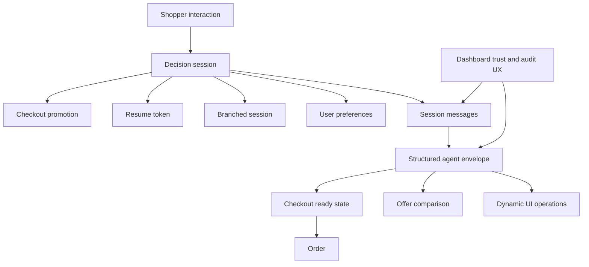

# Domain Concepts

This page describes the repository’s core product concepts and the invariants that matter when changing them. The main ownership boundaries are:

- **Decision continuity and shopping memory**: `services/main-backend/internal/decision_memory`
- **Structured AI response contract**: `services/ai-runtime/src/models/schemas.py`
- **Resume links and notification-based re-entry**: `services/main-backend/internal/resume_session`
- **Checkout and order creation**: `services/main-backend/internal/orders`
- **Checkout incentive lifecycle**: `services/main-backend/internal/promotions`
- **Transparency and inspection UX**: `apps/web/src/features/dashboard/components`

## Concept map

*This diagram shows how a decision session ties together persisted memory, structured agent output, checkout, promotions, and transparency UI.*

## Decision session

A **decision session** is the main persistence unit for a shopping journey. In the backend domain model it carries:

- a session ID
- either a `UserID` or an `AnonymousID`
- a title and status
- an optional `ParentSessionID` for branching
- timestamps
- ordered messages

`DecisionSession` is owned by `services/main-backend/internal/decision_memory/domain`, exposed through Gin handlers in `services/main-backend/internal/decision_memory/handler`, and used by the web API client in `apps/web/src/api/decision-memory.ts`.

### Responsibilities

A session is not just chat history. The surrounding spec and code make it the container for:

- conversation history
- stored AI response envelopes and reasoning payloads
- pinned product snapshots embedded in messages
- session branching lineage
- checkout-readiness continuity and later resume flows

### Lifecycle and state

Current code uses string statuses such as `active` and `archived`.

- new sessions start as `active`
- restore sets status back to `active`
- archive is a bulk maintenance operation on inactive sessions
- branch creates a new active child session and preserves the parent reference

### Concurrency invariant

Session update conflict handling is **last-write-wins with explicit client timestamp comparison**. The browser sends `X-Client-Timestamp`; the repository rejects writes when the client timestamp is older than the persisted `UpdatedAt`. This is the concrete implementation of the spec’s conflict rule and is important for safe autosave changes.

## Session messages and reasoning payloads

A **session message** records a single turn inside a decision session. Besides role and content, the model carries two JSON string fields:

- `ReasoningGraph`
- `PinnedProducts`

In practice the repository persists assistant envelopes in `ReasoningGraph`, and the interaction flow later re-reads that JSON to validate follow-up clarification answers against the most recent active question.

This means `ReasoningGraph` is part of the functional contract, not just debugging data. If its format changes, interaction validation and replay-style UX can break.

## Anonymous identity

The product supports continuity before login through an **anonymous identity**.

### Identity surface

The web client:

- reads `anonymousId` from `localStorage`
- generates one with `crypto.randomUUID()` if absent
- sends it on requests as `X-Anonymous-ID`

The decision-memory handler accepts either authenticated `userID` or this anonymous header.

### Retention invariant

Anonymous sessions are intentionally bounded. On anonymous session creation, the backend counts existing sessions for that anonymous ID, and when the count is already 10 or more it deletes the oldest anonymous session before creating the new one.

This is a key invariant for safe edits:

- the limit is enforced server-side, not just in the browser
- eviction applies only to anonymous sessions with `user_id IS NULL`
- authenticated users do not use this 10-session eviction path

## User preferences

A **user preference** is a reusable shopping signal attached to an authenticated user, such as budget or brand constraints.

The domain model stores:

- preference ID
- `UserID`
- category
- JSON string value
- optional `SourceSessionID`
- timestamps

### Ownership and access rules

Preferences are exposed from the decision-memory handler, but only for authenticated users:

- listing for anonymous users returns an empty list
- update and delete require authenticated identity
- repository queries are keyed by `user_id`

So in current code, preferences are a database-backed cross-session memory feature for logged-in users, not a first-class anonymous persistence surface.

## Session branching

A **branch** is a new session created from an existing one without mutating the original.

The important implementation detail matches the spec: branching is a **full copy** model.

When the repository branches a session it:

- creates a new session ID
- copies `UserID` or `AnonymousID`
- sets `ParentSessionID` to the original session
- creates the new session as `active`
- copies the original messages into the new session with new message IDs

That means branch edits are isolated after creation, while lineage remains visible through `ParentSessionID`.

## Interaction records and idempotent clarification answers

A **session interaction** is the persistence layer for structured UI callbacks such as answering clarification questions.

The domain model stores:

- `SessionID`
- `InteractionID`
- request payload hash
- status
- lease expiry
- persisted response envelope

### Why it exists

The interaction stream handler sends a structured answer to the AI runtime, but it first persists an interaction row so the backend can deduplicate retries and protect against double execution.

### Invariants

- The same `interaction_id` with a different payload hash is rejected as a conflict.
- A pending interaction whose lease is still active is rejected as already in progress.
- A completed interaction reuses the stored response envelope instead of invoking the AI runtime again.
- The lease duration is 120 seconds.
- The interaction request body is capped at 16 KiB, and free-text answers are capped at 1000 characters.

### Validation contract

The interaction flow is tightly coupled to the last assistant envelope stored in `ReasoningGraph`:

- only `schema_version: 1.0`, `event: submit`, `action: question.answer` are accepted
- the incoming `interaction_id`, `question_id`, `source_turn_id`, and `component_id` must match the active question envelope
- selected option IDs must map to the option IDs in the stored question
- at least one option or free-text answer is required

This is one of the repository’s strongest invariants around safe protocol changes.

## Comparison workspace

A **comparison workspace** is a separate decision-memory concept used for active product comparison. It is modeled in `services/main-backend/internal/decision_memory/domain/comparison.go` and abstracted behind `ComparisonRepository`.

### Key rules

- a workspace tracks `WorkspaceID`, `UserID`, `CategoryID`, `ProductIDs`, state, and timestamps
- all products in one workspace must belong to the same category
- the workspace has a four-product capacity
- attempting to add a fifth product does not silently drop one; it moves the workspace into `PENDING_REPLACEMENT`
- marking a product as checkout-ready moves the workspace to `COMPLETED`

This concept connects product comparison to later checkout-readiness flows.

## Structured agent response

The Python AI runtime does not return free-form chat alone. It returns a **structured agent response** defined by Pydantic schemas in `services/ai-runtime/src/models/schemas.py`.

### Envelope shape

All runtime responses are a discriminated union over `type`:

- `question`
- `recommendation`
- `comparison`
- `offer_comparison`
- `checkout_ready`

Shared envelope fields include:

- `schema_version`
- `turn_id`
- `revision`
- `conversation_state`
- `ui_state`
- `ui_operations`

### Dynamic UI contract

The envelope can describe concrete UI operations, not just text. `ui_operations` specify ordered `append` or `replace` actions targeting either the whole surface or a component, with a nested `DynamicUIComponent` tree.

This is the bridge between the stateless Python runtime and the React renderer: backend and frontend expect machine-validated structured UI deltas.

### Shape invariants by response type

`AgentDraft.validate_shape` enforces domain rules before hydration:

- `question` must carry question controls and must not carry reasoning or selections
- non-question responses must not carry question controls
- `comparison` requires at least two selections
- `offer_comparison` requires exactly one selection
- `checkout_ready` requires exactly one selection

These are product-level guarantees, not just schema niceties.

## Recommendation and product concepts

A **recommended product** in the structured response is hydrated from catalog data plus model-selected justification.

The runtime joins:

- catalog identity, name, price, specifications, and metadata image
- model-provided `match_score`
- model-provided explanation

For session-only actions such as comparison, offer comparison, and checkout-ready, the runtime additionally enforces that selected products are present in the allowed session product set. So these later-stage actions cannot arbitrarily introduce a product outside the current session context.

## Offer comparison

An **offer comparison** is the structured representation of one product’s purchasable offer bundle.

The schema includes:

- comparison ID and product ID
- fixed `VND` currency
- offer lines with `required` and `default_selected` flags
- `default_total`
- `base_total`
- a `scheduled_campaign`

A scheduled campaign includes name, start/end timestamps, discount percent, sale price, and savings.

Hydration enforces that `offer_comparison` responses reference exactly one selected product and that an offer must exist for that product in the provided offer map, otherwise the response is rejected.

## Checkout-ready response

A **checkout-ready** response is the structured AI/runtime state that tells the UI the conversation has transitioned from exploration to purchase preparation.

In the runtime schema it:

- has `type: checkout_ready`
- fixes `conversation_state` to `checkout_ready`
- includes a single selected decision product
- renders through a `checkout_summary` UI component in `ui_operations`

At the product level this is distinct from order creation. It is the AI-facing handoff state before the Go checkout service validates and creates an order.

## Resume token

A **resume token** is the credential for reopening an interrupted decision session from another device or channel.

### Security model

The JWT service issues HS256 tokens with:

- `session_id`
- standard registered claims including `jti`, `sub`, `iss`, `iat`, and `exp`
- a 24-hour expiry window

The payload deliberately avoids direct PII fields. Subject is set to the user ID when present, otherwise the session ID.

### Persistence model

The backend stores a `ResumeToken` record containing:

- token ID (`jti`)
- `SessionID`
- optional `UserID`
- SHA-256 hash of the token string
- expiry
- consumed and revoked timestamps
- issued and consumed context hashes

The raw token is therefore not the database key; the hash is.

### Single-use and revocation invariants

These rules matter for safe edits:

- every successful resume marks the token consumed in the database
- consumed tokens are rejected on reuse
- revoked tokens are rejected
- expired tokens are rejected even if the JWT parses and the DB row exists
- issuing a new token for the same session first revokes all prior unconsumed tokens for that session

So only the newest unconsumed link is intended to remain valid.

## Resume context auditing and notification identity

Resume links are designed for cross-device use, so context mismatch is not an automatic denial.

If both issuance and consumption context hashes are present and differ, the service logs an audit-risk message but still consumes the token and resumes the session.

The proactive notification flow also depends on a **verified notification identity**:

- inactivity notification only works for sessions with a non-nil `UserID`
- the service asks `IdentityService` for a verified destination
- if no destination is available, it returns `ErrNoVerifiedIdentity`
- successful or failed sends are written to a `NotificationLog`

Current provider wiring is branded around Zalo in the service and provider package, but the use case depends on abstractions (`IdentityService`, `NotificationProvider`) rather than hard-coded transport calls.

## Order and checkout

An **order** is the backend’s persistent checkout object in `services/main-backend/internal/orders/domain`.

### Core fields

The order stores:

- customer identity and contact info
- fulfillment method
- shipping address
- internal catalog items and optional retailer items
- coupon code
- subtotal, discount, shipping, tax, and total amounts
- status
- estimated delivery window
- confirmation email status

### Validation and ownership rules

The checkout service enforces several critical invariants:

- the authenticated customer ID must match the request customer ID
- fulfillment must be exactly `DELIVERY` or `STORE_PICKUP`
- delivery requires a shipping address, while pickup clears the address
- every order item must contain exactly one of `product_id` or `retailer_offer_id`
- quantities must be positive and item IDs must be valid UUIDs
- duplicate product or retailer offer entries are rejected
- customer profile must already contain name, email, and phone before checkout proceeds

### Commerce flow semantics

The order service supports two sourcing modes:

- **internal catalog items**, priced from product quotes
- **retailer offer items**, refreshed from retailer offer data before checkout

Retailer offer checkout adds more invariants:

- an `Idempotency-Key` header is required when retailer offers are present
- the service hashes the full create payload and uses it with the idempotency key
- reusing the same idempotency key with a different payload becomes a 409 `IDEMPOTENCY_CONFLICT`
- unavailable or stale retailer offers return explicit 409 conflict responses

### Status semantics

- ordinary orders start as `PENDING`
- orders containing retailer items start as `PENDING_SUPPLIER_CONFIRMATION`
- confirmation email state begins as `failed` and becomes `queued` only if enqueueing succeeds

If the order handler has a promotion sink and receives `X-Session-ID`, successful order creation also notifies the promotion service that payment completed for that session.

## Promotions and checkout incentives

A **checkout promotion** is a session-scoped countdown incentive managed in `services/main-backend/internal/promotions`.

### Activation and eligibility

`StartPromotion` is keyed by `sessionID` and is idempotent per session:

- if a promotion already exists for the session, it is returned as-is
- the service does not restart an expired promotion for the same session
- eligibility across sessions is checked via `userID` or `deviceID`
- if a prior promotion’s cooldown is still active, the service rejects a new one

### Timing defaults

Current backend defaults are:

- promotion lifetime: **15 minutes**
- cooldown window: **30 days**

### Lifecycle states

The promotion model defines these statuses:

- `ACTIVE`
- `EXPIRED`
- `COMPLETED_PENDING_VOUCHER`
- `VOUCHER_ISSUED`
- `ERROR_RECOVERABLE`
- `ISSUE_RETRY_REQUIRED`

In current service logic:

- `GetStatus` lazily converts `ACTIVE` to `EXPIRED` when backend time has passed `ExpiresAt`
- successful payment before expiry transitions `ACTIVE` to `COMPLETED_PENDING_VOUCHER`
- voucher issuance success persists `VOUCHER_ISSUED`
- voucher issuance failure persists `ISSUE_RETRY_REQUIRED`
- payment after expiry does not issue a voucher

### Identity surfaces

The HTTP handler requires:

- `X-Session-ID`
- either `X-User-ID` or `X-Device-ID`

This ties incentives to either authenticated users or anonymous-device continuity.

## Voucher issuance

Voucher issuance is abstracted behind `VoucherGenerator`.

The current default implementation is local and returns a generated voucher ID and code, while comments explicitly describe exactly-once issuance as the intended invariant for a future persisted vouchers table with a uniqueness constraint on `promotion_id`.

That means the business interface is stable, but strong exactly-once guarantees are currently aspirational rather than fully enforced by this in-memory generator alone.

## Transparency UX concepts

The dashboard exposes several user-facing concepts that make AI-assisted shopping inspectable.

### Trust center

`TrustCenterHeader` renders a **trust score** and supporting **trust factors** such as:

- benchmark source count
- review coverage
- retail consensus
- confidence evolution

These are UI-level concepts today, but they represent a stable product promise: recommendations should expose confidence signals rather than only final answers.

### Audit trail

`AuditTrail` renders:

- a timeline of logs with running and done states
- replay controls for the decision flow
- the current user intent
- active clarification questions via `ClarificationCard`
- an input surface for injecting extra constraints

This is where the structured envelope, persisted reasoning data, and interaction callback model become visible to the shopper.

## Safe-change watch-outs

- **Do not treat anonymous continuity as unlimited storage.** The backend-enforced 10-session cap is intentional.
- **Do not weaken resume-link single-use rules.** Consumption, revocation, and expiry checks are layered across JWT verification and DB state.
- **Do not change assistant envelope shape casually.** The AI runtime schema, the Gin interaction validator, and the React dynamic UI renderer depend on aligned field semantics.
- **Do not bypass checkout idempotency for retailer offers.** The `Idempotency-Key` plus payload hash path prevents duplicate or conflicting supplier-facing orders.
- **Do not assume trust and audit UI are cosmetic.** They are product-level transparency surfaces backed by persisted messages and structured responses.
- **Be careful when changing comparison workspace rules.** Category matching, four-product capacity, and pending-replacement behavior are explicit domain constraints, not incidental implementation details.
