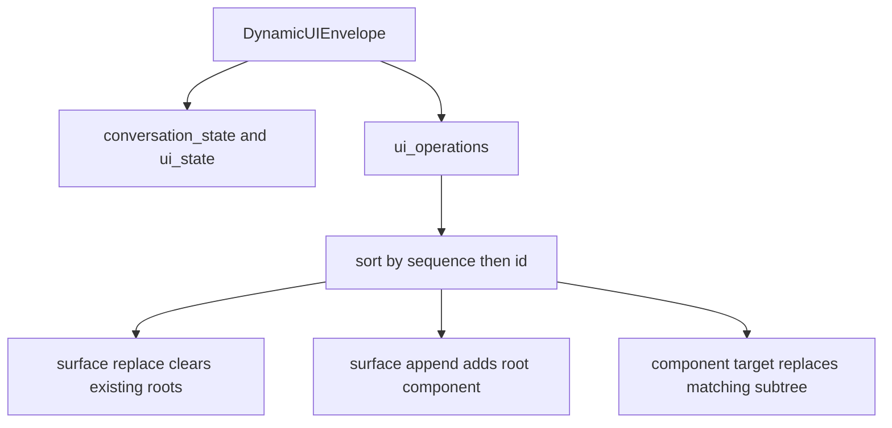
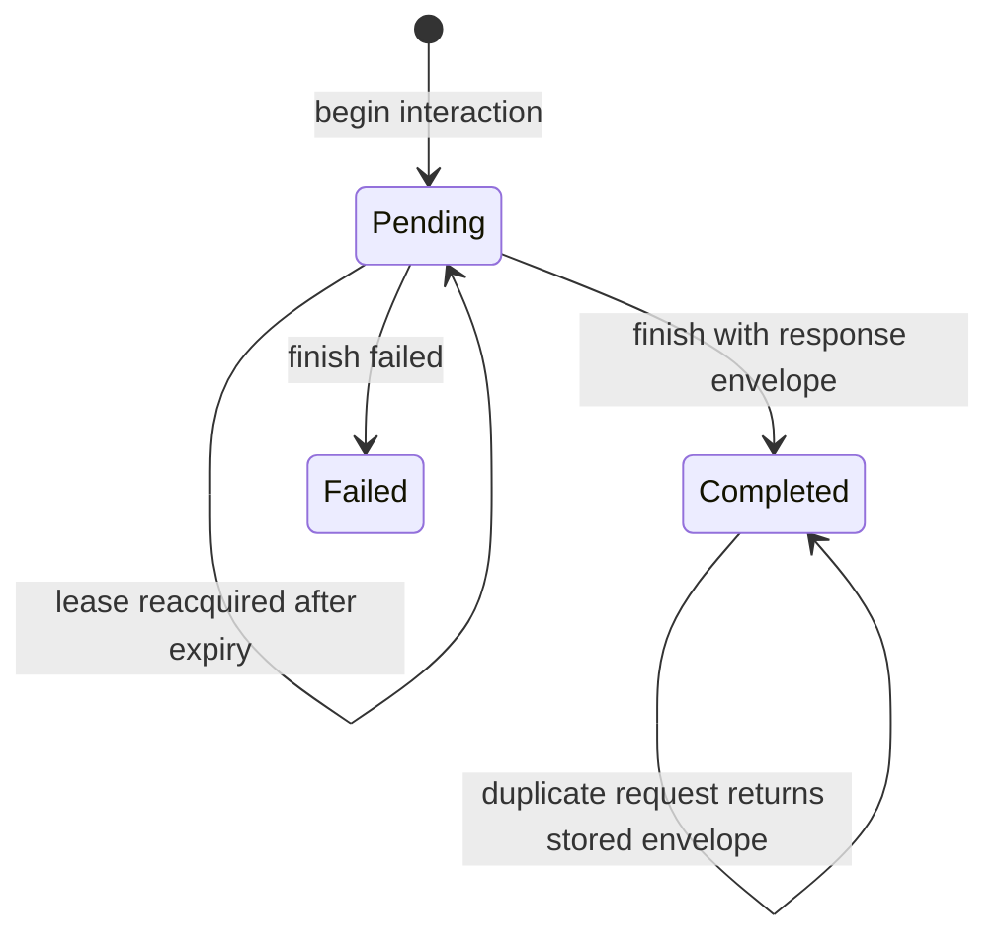
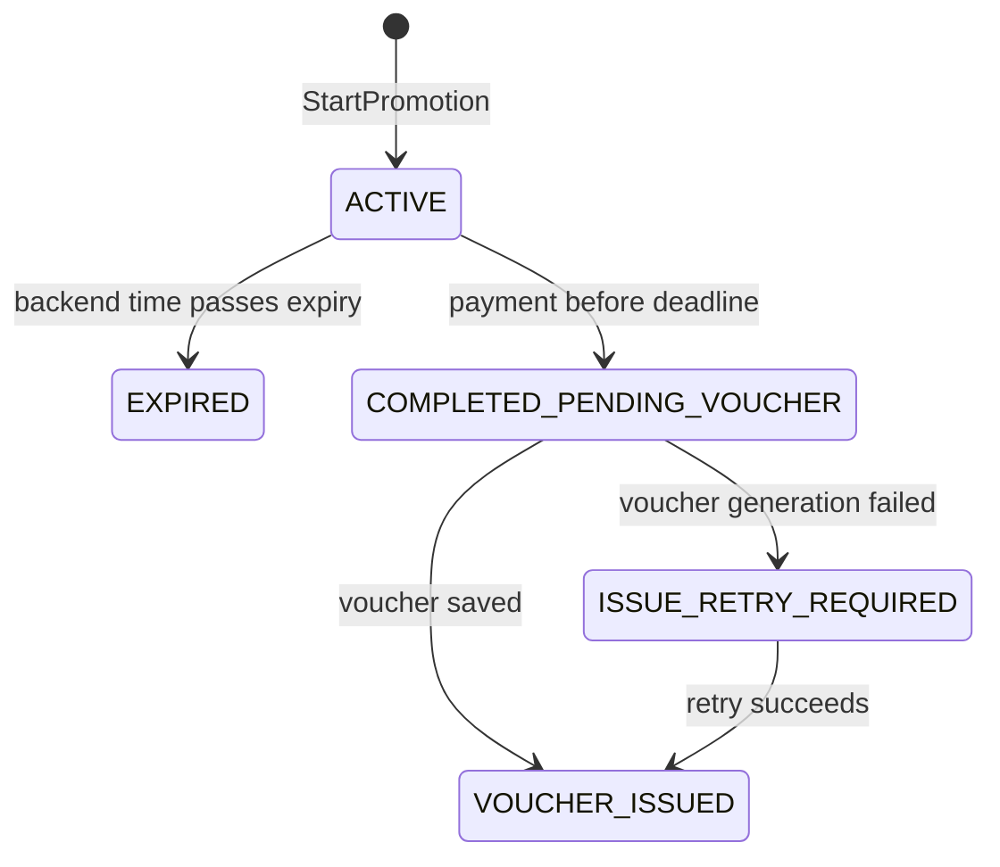

# Domain Concepts and Invariants

This page describes the business objects and behavioral rules that matter across SHOPWISE services. It focuses on invariants that shape safe changes: what counts as a valid decision session interaction, which data is authoritative at checkout time, how resume tokens are issued and consumed, how accessory offers become checkout-eligible, and how promotions expire or cool down.

## Decision sessions

A `DecisionSession` is the long-lived container for a shopping decision, not just a chat thread. It owns session identity, optional authenticated or anonymous ownership, a possible parent session for branching, timestamps, and the ordered message history. Messages can carry both human-visible text and machine-readable artifacts such as `ReasoningGraph` and `PinnedProducts`, which lets later flows validate follow-up interactions against the exact assistant output that was previously shown.

`SessionInteraction` is a separate persistence concept from messages. It records a client interaction against a session with an `interaction_id`, payload hash, lease, status, and an optional cached response envelope. That separation is important because the system treats interactive UI actions as idempotent work items, not as fire-and-forget form posts.

## Dynamic AI envelopes and UI operations

The repository uses a constrained dynamic UI contract rather than arbitrary frontend instructions.

A `DynamicUIEnvelope` carries:
- fixed `schema_version: "1.0"`
- a `turn_id`
- a monotonic `revision`
- a coarse `conversation_state`
- a `ui_state` with `loading`, `ready`, or `error`
- ordered `ui_operations`

The schema enumerates the allowed component types and action names up front. That keeps AI output inside a whitelisted UI vocabulary: layout containers, product and commerce components, interaction controls, reasoning and confidence displays, and explicit recovery actions like retry or continue-with-cached-data. The JSON schema also blocks dangerous prop names such as `html`, `script`, `style`, and `dangerouslySetInnerHTML`, so the envelope is intended to describe UI structure and state, not inject executable content.

`UIOperation` is an ordered patch model. Operations are sorted by `sequence`, with `id` used as a tie-breaker, before being applied to the in-memory surface. A surface-level `replace` clears existing roots before inserting the new component, while a component-targeted operation recursively replaces a specific subtree by `target_id`. In other words, envelope consumers should treat the operation list as deterministic state transition input, not as an already-applied snapshot.

```mermaid
flowchart TD
    Env["DynamicUIEnvelope"] --> State["conversation_state and ui_state"]
    Env --> Ops["ui_operations"]
    Ops --> Sort["sort by sequence then id"]
    Sort --> SurfaceReplace["surface replace clears existing roots"]
    Sort --> SurfaceAppend["surface append adds root component"]
    Sort --> ComponentReplace["component target replaces matching subtree"]
```
Caption: Dynamic UI envelopes describe deterministic UI state transitions through ordered operations.

## Interactive question handling invariants

The current interactive backend path is intentionally narrower than the full protocol vocabulary. `POST` interaction handling accepts only schema version `1.0`, event `submit`, and action `question.answer`. The request body is capped at 16 KiB, free text is capped at 1000 characters, and the server validates the request against the latest assistant message that contains a stored question envelope.

That validation enforces several non-obvious invariants:
- the submitted `interaction_id`, `payload.question_id`, and `source_turn_id` must all match the active clarification question
- the `component_id` must either be the question itself or a component that existed inside the stored UI operations
- single-choice questions cannot submit more than one option
- selected option IDs must be known and unique
- at least one answer must be present after combining selected options and trimmed free text

These rules mean the backend treats the prior assistant envelope as authoritative context for follow-up answers. A client cannot safely synthesize a new question state locally and expect the backend to accept it.

## Interaction idempotency and replay behavior

Session interactions are protected with database-backed idempotency and short leases.

When an interaction begins, the repository locks or creates a `(session_id, interaction_id)` record. The stored payload hash must match the current request hash; otherwise the backend rejects the request as an interaction conflict. If the same interaction is already `pending` and its lease has not expired, the backend returns an in-progress conflict. If a prior attempt already reached `completed`, the backend can return the stored `ResponseEnvelope` instead of calling the AI runtime again.

A lease expiry lets the backend reacquire an abandoned interaction and continue processing, but only for the same hashed payload. This gives the system three key guarantees:
- duplicate submissions with the same payload do not fan out duplicate AI work
- reuse of an interaction ID with different content is rejected
- successful responses are replayable from persisted backend state

```mermaid
stateDiagram-v2
    [*] --> Pending: begin interaction
    Pending --> Completed: finish with response envelope
    Pending --> Failed: finish failed
    Pending --> Pending: lease reacquired after expiry
    Completed --> Completed: duplicate request returns stored envelope
```
Caption: Session interactions behave like leased idempotent work records with replay for completed responses.

## Checkout and order invariants

An `Order` is the checkout snapshot that turns validated shopping intent into a persisted purchase record. It stores customer identity fields, fulfillment choice, normalized item lines, optional retailer accessory lines, coupon code, computed monetary fields, status, estimated delivery dates, and confirmation-email status.

Several checkout rules are easy to miss unless you read the service and tests:

### Identity and customer snapshot rules

Order creation and listing require the authenticated customer ID to match the requested customer ID. The checkout service also insists that customer profile fields `Name`, `Email`, and `Phone` are already populated before checkout succeeds. Those values are copied into the order, so the order preserves a customer snapshot instead of depending on future profile reads.

### Item validation and authoritative pricing

Each requested line must contain exactly one of `product_id` or `retailer_offer_id`, with a positive quantity and no duplicates within each ID category. Checkout never trusts caller-supplied prices. It reloads product quotes from the catalog and retailer offer quotes from backend storage, then computes line totals from those authoritative values.

For internal catalog products, checkout requires the product to exist, be available, have enough stock, and have a positive unit price. Tests explicitly verify that the stored order unit price comes from the official backend quote.

### VAT-inclusive arithmetic

Consumer catalog prices are treated as VAT-inclusive, so the checkout tax percentage is currently zero. Discounts apply only to the internal catalog subtotal, and retailer accessory lines are then added to the already-taxed internal total. Tests verify that mixed orders keep `TaxAmount` at zero and that total arithmetic remains VAT-inclusive.

### Retailer accessory lines and idempotent checkout

Retailer accessory lines are modeled as `RetailerItem`s containing the selected offer ID, name, quantity, unit price, source URL, and verification timestamp. When any retailer offer is present, checkout requires an `Idempotency-Key`, hashes the full create payload, and consults an idempotent order repository before refreshing retailer offers. Reusing the same key with a different payload is treated as a conflict.

If retailer items are present, the resulting order status becomes `PENDING_SUPPLIER_CONFIRMATION` instead of ordinary `PENDING`.

## Backend-authoritative hydration of products and offers

The most important cross-service checkout invariant is that backend hydration, not client payloads, determines what is actually purchased.

For products, the checkout repository reloads current product price and inventory from backend product records. For accessory offers, it reloads stored offer metadata and accessory names from the backend database, and it only exposes ShopWise-owned offers if the offer's accessory is compatible with at least one of the products in the order.

For non-ShopWise retailers, checkout can refresh the stored offer from the external source at order time. If the refreshed offer is unavailable, invalid, or out of stock, checkout fails. If the refreshed price differs from the stored price, the backend persists the refreshed snapshot and returns an `OfferChangedError` so the client must retry explicitly against the new authoritative price. Tests also verify the opposite rule for ShopWise bundle lines: ShopWise-owned offers are already authoritative in backend storage, may validly have a zero price, and must not trigger external refresh.

This is the rule that keeps the buyer-visible cart from drifting into a stale or forged purchase request.

## Accessory offers and compatibility

Accessory recommendation and accessory checkout share the same business primitives:
- `Accessory` describes the item itself
- `RetailerOffer` describes a current sellable offer for that accessory
- `AccessoryCompatibility` explains why an accessory fits a laptop category or a specific product model
- `LaptopCompatibilityProfile` captures model-specific upgrade facts such as RAM or storage slots

The recommendation service classifies offer freshness by `FetchedAt`:
- `fresh` when fetched within 6 hours
- `stale` when older than 6 hours but not older than 72 hours
- `unavailable` when out of stock, non-positive price, or older than 72 hours

Recommendations can still include stale offers, but offers older than 72 hours are dropped if already unavailable. `CheckoutAvailable` is stricter: it requires a `fresh` offer and in-stock status.

Compatibility also has a trust hierarchy. A product-specific compatibility row overrides a category-level row. For upgrade accessories, category-only matching is not enough: the target product must have a verified upgrade profile and the winning compatibility must be model-specific and `verified_model`. This prevents the system from promising upgrade accessories using only generic category assumptions.

## Resume tokens and notification identity

A `ResumeToken` is the single-use credential that links a notification back to a decision session. Stored token state includes a stable token ID, session ID, optional user ID, SHA-256 token hash, expiry time, consumed and revoked timestamps, optional issued and consumed context hashes, and creation time. Notification attempts are tracked separately in `NotificationLog` with provider, status, optional error details, and timestamp.

The JWT itself contains only the session ID plus registered claims such as JTI, subject, issuer, issue time, and expiry. The service signs tokens with HS256, gives them a 24-hour lifetime, and chooses the JWT subject as the user ID when available, otherwise the session ID. Persistence stores only the hash of the signed token, not the raw token.

### Resume-token lifecycle invariants

Before issuing a new token for a session, the service revokes all older unconsumed tokens for that same session. Resuming a session requires all of the following to hold:
- the JWT verifies successfully
- the stored token hash exists
- stored token ID and session ID match the JWT claims
- the token was not revoked
- the token was not already consumed
- the token is not expired according to backend time

On successful resume, the service records consumption and then loads the decision session. If both issued and consumed context hashes are present and differ, the service logs an audit-risk message but does not block the resume. That makes context mismatch a risk signal rather than an access control rule.

### Verified notification identity

Inactivity notifications can only be triggered for sessions that belong to a user with a verified notification identity. Anonymous sessions cannot use this flow. The service resolves the destination through `IdentityService`, generates a fresh token, sends it through the notification provider, and writes a `NotificationLog` even when the send fails.

## Promotions, expiry, and cooldown

`CheckoutPromotion` models a session-scoped incentive flow around checkout. It ties a promotion to a single `SessionID`, optional `UserID` or `DeviceID`, a trigger such as `saved_product` or `started_checkout`, a lifecycle status, voucher state, campaign defaults, start and expiry timestamps, and an optional cooldown deadline.

### Session idempotency and cross-session eligibility

Promotion start is idempotent per session. If a promotion already exists for the same session, the service returns it as-is and never restarts the timer, even if that promotion has already expired.

Eligibility for a new promotion is separate from session idempotency. Before creating a promotion for a new session, the service looks up the latest promotion for the same user or device. If that prior promotion has a future `CooldownUntil`, the user is ineligible and start fails. New promotions currently default to a 15-minute active window and a 30-day cooldown period.

### Backend-authoritative expiry and voucher issuance

Promotion expiry is enforced by backend time, not by the client.

`GetStatus` performs lazy evaluation: if a stored promotion is still marked `ACTIVE` but the current time has passed `ExpiresAt`, the service flips it to `EXPIRED` and persists that state change. `HandlePaymentCompleted` applies the stricter rule that matters for rewards: if payment completes after the deadline, the backend marks the promotion expired and does not issue a voucher.

If payment completes before expiry and the promotion is still active, the service transitions it to `COMPLETED_PENDING_VOUCHER` and attempts voucher issuance. Successful issuance stores the voucher ID and moves the promotion to `VOUCHER_ISSUED`. Voucher-generation failure moves the promotion to `ISSUE_RETRY_REQUIRED`, and only that state allows explicit retry.

```mermaid
stateDiagram-v2
    [*] --> ACTIVE: StartPromotion
    ACTIVE --> EXPIRED: backend time passes expiry
    ACTIVE --> COMPLETED_PENDING_VOUCHER: payment before deadline
    COMPLETED_PENDING_VOUCHER --> VOUCHER_ISSUED: voucher saved
    COMPLETED_PENDING_VOUCHER --> ISSUE_RETRY_REQUIRED: voucher generation failed
    ISSUE_RETRY_REQUIRED --> VOUCHER_ISSUED: retry succeeds
```
Caption: Checkout promotions are session-scoped, expire by backend time, and only issue vouchers before the deadline.

## Safe-change watch-outs

- Do not broaden interaction handling on the client without matching backend validation; the backend currently accepts only the clarification-question path.
- Treat `interaction_id` as an idempotency key with payload binding, not as a cosmetic identifier.
- Do not let checkout trust prices, bundle membership, or offer freshness from the browser; backend reloads and refresh rules are deliberate.
- Preserve the distinction between ShopWise-owned accessory offers, which backend storage treats as authoritative, and external retailer offers, which may require refresh and explicit retry on price change.
- Keep resume tokens single-use and revoke older unconsumed tokens on reissue, or the notification-resume flow loses its security model.
- Keep promotion deadline and cooldown decisions on backend time; tests rely on expiry and eligibility being server-authoritative.
