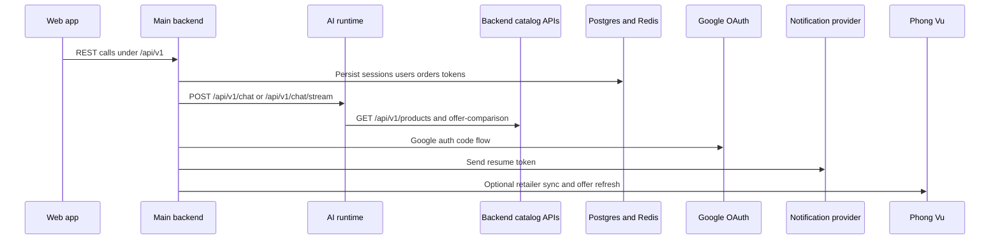
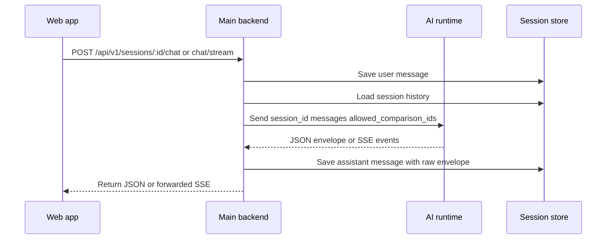

# Integration Points

## Overview

SHOPWISE is split across a TypeScript web app, a Go main backend, and a Python AI runtime, with several additional infrastructure and third-party boundaries around them. The important integration points today are:

- web app ↔ main backend REST APIs
- main backend ↔ AI runtime chat APIs
- AI runtime ↔ backend catalog and offer APIs
- main backend ↔ Postgres, Redis, and Redis-backed jobs
- main backend identity ↔ Google OAuth
- resume-session flow ↔ notification delivery provider
- main backend ↔ Phong Vu retailer scraping/offer refresh integration
- shared schema and protocol packages consumed across services and the web app

This page focuses on both sides of each boundary, the fail-closed behavior that matters in production, and the code or tests that verify the contract.

Caption: The main runtime boundaries center on REST between web, backend, and AI runtime, with backend-owned persistence and external integrations.

## Web app to backend REST boundary

The web app talks to the main backend through `/api/v1` routes. In the decision-memory client, `API_BASE` is `/api/v1/sessions`, so session creation, greeting, listing, branching, autosave, and chat all resolve relative to the backend route group that bootstrap registers at `/api/v1/sessions`. The same file also sends `Authorization: Bearer ...` when a token is present and always provisions an `X-Anonymous-ID` in local storage for anonymous session ownership. On the backend side, decision-memory handlers use optional bearer auth plus the anonymous header, and reject requests that have neither a verified user nor an anonymous identifier. 

Important consequences:

- anonymous decision-memory access is deliberate, not an accident
- session ownership checks are enforced again on the backend, including for chat and session reads
- frontend helpers are coupled to backend route names, headers, and some response shapes

### Session and chat contract

For chat, the web client posts `{ message }` to `/api/v1/sessions/:id/chat` and validates the returned envelope with a local Zod schema. That schema already accepts `schema_version` `1.0` and `1.1`, plus dynamic UI fields such as `conversation_state`, `ui_state`, and `ui_operations`. This is broader than the older `@shopwise/ui-protocol` document model used by the generic protocol renderer, which still expects `schemaVersion: "1.0"` and a `DynamicUIDocument` shape. In practice, the decision-memory path is integrated directly against the AI envelope, not through the older document wrapper.

### Request and ownership checks

The backend decision-memory handler:

- optionally extracts a JWT subject into `userID`
- reads `X-Anonymous-ID`
- requires one of those identities for create and list operations
- checks that the targeted session is owned by that user or anonymous id before reading or forwarding chat

Tests in `chat_test.go` verify that another anonymous user gets a `404` and the AI runtime is not called.

## Main backend to AI runtime boundary

This boundary is owned primarily by `internal/decision_memory/handler/chat.go` on the Go side and `src/api/chat.py` on the Python side.

### Responsibility split

The backend side is responsible for:

- validating session identity and ownership
- persisting the user message before calling the runtime
- reconstructing the prior user and assistant history from session messages
- extracting `allowed_comparison_ids` from prior assistant reasoning payloads
- proxying either a normal JSON response or an SSE stream
- persisting the final assistant message and raw envelope after a successful runtime response

The AI runtime side is responsible for:

- validating the incoming `ChatRequest`
- building a workflow with an `OpenAIProvider` and `ToolProxy`
- producing a validated `AgentResponse`
- translating model failures that originate in backend tool calls into `502 catalog unavailable`
- emitting named SSE events for stream consumers

### Concrete HTTP contract

The current runtime endpoints are:

- `POST /api/v1/chat`
- `POST /api/v1/chat/stream`
- `POST /api/v1/greeting`

The backend proxies to `/api/v1/chat` and `/api/v1/chat/stream` by concatenating `AI_RUNTIME_URL` with those paths. Tests on both sides check those exact routes, so the current code is aligned on route prefix and path.

### Streaming contract

The AI runtime stream currently emits named SSE blocks in this order:

- `token` with the response message text
- decision event matching the response type for recommendation-style turns
- one `ui_operation` event per UI operation
- `envelope` with the full validated response
- `done`

The backend does not simply tunnel bytes. It scans incoming SSE blocks, accumulates message text, remembers decision and full-envelope events, forwards the stream to the client, and on `done` persists either the validated full envelope or a reconstructed fallback envelope. This means the backend owns the durable conversation record even for streaming turns.

Caption: The backend is the boundary owner for identity and persistence, while the AI runtime owns validated generation and SSE event production.

### Current mismatch to watch: URL alignment is configuration-sensitive

The route prefix itself is aligned today, but this integration is still fragile because each side owns a different base URL setting:

- main backend uses `AI_RUNTIME_URL`, default `http://localhost:8000`
- AI runtime uses `backend_url`, default `http://localhost:18080`

If one service moves without the other, the failure mode is fail-closed: the backend returns `502 failed to connect to AI Runtime`, and the AI runtime tool proxy raises HTTP errors instead of silently falling back. When changing ports, docker wiring, or reverse proxies, verify both directions together.

## AI runtime back to backend catalog and offer APIs

The AI runtime does not reach Postgres directly. Its `ToolProxy` calls the main backend over HTTP using `backend_url` as the base URL. Today it uses two backend APIs:

- `GET /api/v1/products` for catalog hydration
- `GET /api/v1/products/:id/offer-comparison` for retailer offer bundles and campaign comparisons

The tool layer validates the returned payloads into Pydantic `CatalogProduct` and `OfferComparison` models. The product model accepts both uppercase Go-style JSON keys such as `ID` and `Name` and lowercase aliases, which is important because the backend currently serializes GORM models directly while the Python runtime expects normalized fields internally.

This boundary is guarded by tests on both sides:

- `test_tool_proxy.py` asserts the exact backend paths and that backend failures are not hidden by fallback behavior
- `offer_test.go` verifies the backend constructs authoritative offer-comparison bundles and scheduled campaign pricing

### Session-scoped product actions

A second contract across this boundary is behavioral rather than purely structural. The backend computes `allowed_comparison_ids` from prior assistant messages stored in `ReasoningGraph`, sends them to the runtime, and the runtime refuses comparison, offer-comparison, and checkout-ready actions for products not already available in the session. That keeps model output constrained to products the session has actually seen.

## Main backend to Postgres, Redis, and jobs

Bootstrap shows that the backend cannot start without both Postgres and Redis:

- `database.Connect(cfg.DatabaseURL, cfg.GinMode)` must succeed
- `cache.Connect(cfg.RedisURL)` must succeed
- `job.NewClient(cfg.RedisURL)` must also succeed

Config loading also fails if `DATABASE_URL`, `REDIS_URL`, or `JWT_SECRET` are absent.

### Postgres

Postgres is the durable system of record for domain data. Bootstrap wires repositories for users, identity, orders, decision memory, accessories, resume sessions, and promotions from the shared database handle. The migration path in `bootstrap.Migrate()` runs the matching repository migrations for those domains.

### Redis and health

Redis plays two roles:

- cache and liveness dependency checked by `/health`
- transport for the Asynq job client

The health handler returns `503 degraded` if either the database or Redis ping fails, so Redis availability is part of service readiness, not just an optional optimization.

### Jobs

The backend job client is also Redis-backed and defines concrete task types for welcome email, price check, Phong Vu accessory sync, and order confirmation. Bootstrap wires order confirmation enqueueing into the orders service. Operationally, this means Redis failure blocks not only cache-like concerns but also async delivery paths.

## Identity boundary: backend and Google OAuth

Identity is primarily backend-owned, with Google as an external provider.

### Backend JWTs vs resume JWTs

The repository currently uses the same `JWT_SECRET` to initialize both the identity JWT service and the resume-session JWT service, but they model different lifecycles and trust semantics:

- identity JWTs carry regular authenticated access and refresh behavior
- resume tokens are single-use session recovery tokens that are revoked, consumed, and audited in a separate resume-session flow

Readers should not treat those as interchangeable just because they share a secret source.

### Google OAuth flow

Google OAuth is wired only when both `GOOGLE_CLIENT_ID` and `GOOGLE_CLIENT_SECRET` are configured. `NewGoogleOAuthService` returns `nil` when OAuth is not enabled, so this integration is effectively disabled by omission rather than mocked.

When enabled, the backend:

- builds a Google OAuth client with `openid`, `email`, and `profile` scopes
- starts the flow at `/api/v1/identity/google/start`
- stores an HTTP-only state cookie
- exchanges the callback code with Google
- fetches `https://www.googleapis.com/oauth2/v3/userinfo`
- redirects the browser to `${WEB_APP_URL}/auth/callback` with access and refresh tokens in query parameters

That last redirect means the web app and backend must agree on `WEB_APP_URL` and callback handling, or OAuth succeeds with Google but fails at the final handoff.

## Resume-session notification delivery boundary

The resume flow is intentionally provider-shaped. The `resume_session` use case depends on a `NotificationProvider` interface whose `Send` method returns a delivery status, optional error details, and an error value.

### What the backend owns

The backend resume service:

- loads the decision-memory session
- requires a verified notification identity for authenticated users
- revokes any unconsumed prior tokens for that session
- issues a new resume JWT
- stores only a SHA-256 token hash plus metadata in Postgres
- sends the raw token through the notification provider
- persists a notification log with provider name, status, and optional error details
- later validates, audits, and consumes the token on resume

This keeps the sensitive bearer token out of durable storage while preserving replay and revocation checks.

### Retry semantics

`RetryableProvider` wraps the provider with exponential backoff for `StatusRetryableFailure`, but returns immediately for `Accepted` or `Failed`. That means retry behavior is part of the integration contract, not just a caller convention.

### Current provider wiring

Bootstrap currently wires a Zalo provider and then wraps it in `NewRetryableProvider(zaloProv, 1)`. So the boundary is abstracted, but the deployed provider name and notification log values are still Zalo-specific today.

## Phong Vu and catalog-related external integrations

The most explicit retailer integration in the current repository is Phong Vu.

### Fail-closed feature flag

`.env.example` documents `PHONGVU_CONNECTOR_ENABLED=false` with a comment that the connector stays disabled until Phong Vu robots and terms are explicitly approved. Bootstrap passes that flag into `phongvu.NewOfferRefresher(...)` when wiring retailer offers for orders.

That makes this a meaningful fail-closed switch: the code path exists, but enabling retailer synchronization is an explicit operational decision rather than a default behavior.

### Contract and safety checks

`client_test.go` shows what the integration expects from the retailer boundary:

- catalog parsing accepts structured product data embedded in HTML
- duplicate products are deduplicated
- VND price parsing is normalized
- requests honor caller timeouts
- non-Phong-Vu hosts are rejected
- public catalog links can be followed to detail pages

Those tests matter more than the scraper internals because they define the safety and normalization guarantees other code can rely on.

## Shared contracts and schema packages

Several packages define cross-boundary types, but they are not all equally current.

### `@shopwise/protocols`

The decision-memory web client imports `InteractionRequest` and shared dynamic UI operation logic from `@shopwise/protocols`. This package currently models the newer envelope approach with fields like:

- `schema_version`
- `turn_id`
- `revision`
- `conversation_state`
- `ui_operations`

It also exposes `applyUIOperations`, which encodes how multiple operations are ordered and applied on the client.

### `@shopwise/ui-protocol`

`@shopwise/ui-protocol` still exports an older protocol surface built around `DynamicUIDocument` with:

- `protocol: "dynamic-ui"`
- `schemaVersion: "1.0"`
- top-level `root`
- generic `InteractionEvent`

The generic protocol renderer in the web app rejects any schema version other than `1.0`. That is a real mismatch with the AI runtime, which now returns `schema_version: "1.1"` envelopes rather than this older wrapped document shape.

### `packages/api-types`

`packages/api-types` re-exports decision-memory, identity, and promotions API schemas, but the current end-to-end decision-memory envelope validation in the web app lives directly in `apps/web/src/api/decision-memory.ts` rather than exclusively through this package. For changes to session or agent response payloads, verify the actual consumer path, not just package exports.

## Operational flags and failure semantics to verify together

The most important configuration and fail-closed behaviors at these boundaries are:

- `AI_RUNTIME_URL` on the backend must point to the runtime base URL actually serving `/api/v1/chat`
- `backend_url` on the AI runtime must point back to the backend base URL actually serving `/api/v1/products`
- `PHONGVU_CONNECTOR_ENABLED` defaults to `false` and should stay false unless retailer approval and operational readiness are explicit
- `CHECKOUT_AUTH_BYPASS` is further gated by `GIN_MODE == "debug"`, so setting the env var alone does not bypass auth in non-debug modes
- Google OAuth is disabled unless both Google client credentials are present
- backend startup fails without Postgres, Redis, and JWT secret configuration

## Focused tests that currently define the integration contracts

When changing an integration point, these tests are good first rechecks because they verify the boundary, not just implementation details:

- `services/main-backend/internal/decision_memory/handler/chat_test.go`
  - backend forwards session history correctly
  - backend blocks unauthorized anonymous access
  - backend persists assistant output for chat and stream modes
- `services/ai-runtime/tests/integration/test_chat_endpoint.py`
  - runtime serves `/api/v1/chat`, `/api/v1/chat/stream`, and `/api/v1/greeting`
  - stream uses named SSE events
  - greeting has a localized fallback path
- `services/ai-runtime/tests/unit/test_tool_proxy.py`
  - runtime calls exact backend catalog paths
  - backend failures surface as errors instead of hidden fallback
- `services/main-backend/internal/catalog/handler/offer_test.go`
  - offer-comparison payload semantics stay authoritative
- `services/main-backend/internal/accessories/phongvu/client_test.go`
  - retailer parsing, host validation, and timeout guarantees stay intact

## Safe-change checklist

When editing one side of an integration, check the peer boundary at the same time:

- **Web session client changed?** Recheck backend route registration, required headers, and response envelope shape.
- **AI runtime moved or re-prefixed?** Recheck `AI_RUNTIME_URL`, runtime route definitions, and the backend proxy paths together.
- **Backend catalog payload changed?** Recheck `ToolProxy` validation aliases and runtime tests.
- **Dynamic UI schema changed?** Recheck both `@shopwise/protocols` and the older `@shopwise/ui-protocol` consumers for version drift.
- **Notification provider changed?** Recheck token issuance, hash-only persistence, retry semantics, and notification logging as one flow.
- **Phong Vu integration changed?** Recheck host validation, timeout behavior, and whether `PHONGVU_CONNECTOR_ENABLED` should still fail closed.
- **Auth behavior changed?** Recheck anonymous decision-memory ownership, OAuth final redirect to `WEB_APP_URL`, and the debug-only bypass gates.
