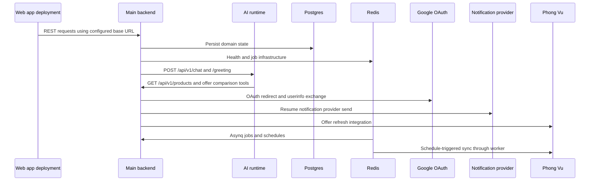

# Integration Points and External Dependencies

This page separates **internal service boundaries inside the repository** from **true external dependencies**. The main integration seams are:

- web deployment configuration ↔ main backend base URL
- main backend ↔ AI runtime HTTP API
- AI runtime ↔ main backend tool endpoints
- backend processes ↔ Postgres and Redis
- backend identity ↔ Google OAuth
- resume-session use case ↔ notification provider abstraction, currently Zalo-shaped
- worker ↔ Phong Vu catalog and offer refresh integrations
- operator-facing debug surfaces such as Swagger

## Integration map

```mermaid
sequenceDiagram
    participant Web as Web app deployment
    participant Backend as Main backend
    participant AIR as AI runtime
    participant DB as Postgres
    participant Redis as Redis
    participant Google as Google OAuth
    participant Zalo as Notification provider
    participant PV as Phong Vu
    Web->>Backend: REST requests using configured base URL
    Backend->>DB: Persist domain state
    Backend->>Redis: Health and job infrastructure
    Backend->>AIR: POST /api/v1/chat and /greeting
    AIR->>Backend: GET /api/v1/products and offer comparison tools
    Backend->>Google: OAuth redirect and userinfo exchange
    Backend->>Zalo: Resume notification provider send
    Backend->>PV: Offer refresh integration
    Redis->>Backend: Asynq jobs and schedules
    Redis->>PV: Schedule-triggered sync through worker
```
Caption: Main internal and external integration boundaries documented on this page.

## Internal service boundaries

### Main backend to AI runtime

The Go backend treats the Python AI runtime as a separate HTTP service configured by `AI_RUNTIME_URL`, defaulting to `http://localhost:8000`. The decision-memory handler trims any trailing slash and calls the runtime at `/api/v1/chat`, `/api/v1/chat/stream`, and `/api/v1/greeting`; the FastAPI app mounts its router under `/api/v1`, so callers must preserve that prefix when changing either side. The backend sends JSON and maps transport or invalid-response failures to `502 Bad Gateway` style errors.

The request contract is stateful from the backend side:

- the backend first validates that the caller owns the decision session
- it persists the new user message before calling the runtime
- it reloads session history and forwards only `user` and `assistant` messages
- it derives `allowed_comparison_ids` from previously stored assistant reasoning payloads
- after a successful runtime response, it persists the assistant message and stores the full envelope in `ReasoningGraph`

For streaming chat, the backend proxies Server-Sent Events from `/api/v1/chat/stream`, forwards SSE blocks to the caller, reconstructs the final assistant payload from `token`, decision, and `envelope` events, and persists the assistant message when the stream finishes. If persistence fails at the end of the stream, the client receives an SSE `error` event.

The AI runtime itself does not talk directly to browsers. It exposes:

- `POST /api/v1/chat` returning a validated `AgentResponse`
- `POST /api/v1/chat/stream` returning SSE
- `POST /api/v1/greeting` returning `{ "message": ... }`
- `GET /health` for process health

All runtime responses include `X-Process-Time`, added by FastAPI middleware.

### AI runtime back to backend tool APIs

The runtime also calls back into the Go backend through `ToolProxy`, configured by `backend_url` and defaulting to `http://localhost:18080`. This is an **internal cross-service API**, not a public third-party dependency.

Current tool calls are:

- `GET /api/v1/products` for catalog search input
- `GET /api/v1/products/{product_id}/offer-comparison` for offer comparison data

These tool calls use an `httpx.AsyncClient` with a 10 second timeout. If those endpoints fail, the runtime raises `httpx.HTTPError`, and the chat endpoint converts that into `502 catalog unavailable`.

### Decision-memory caller headers and identity rules

Decision-memory routes support both authenticated and anonymous callers, so headers materially change behavior:

- `Authorization: Bearer <token>` is optional on session routes because `OptionalAuth` silently ignores missing or invalid bearer tokens
- `X-Anonymous-ID` is the anonymous identity channel used when no authenticated user is present
- at least one of authenticated user ID or `X-Anonymous-ID` is required to create or list sessions
- session ownership checks compare the stored session either to the authenticated user ID or to the anonymous ID
- `X-Client-Timestamp` is required on `UpdateSession` and is used for optimistic conflict detection; `RenameSession` accepts it but falls back to current server time if absent or invalid

This makes the decision-memory boundary unusual compared with the rest of the backend: some routes are intentionally usable without strict bearer auth, but they still require a stable identity signal.

### Greeting generation fallback path

Greeting generation is a softer dependency than chat. The backend collects recent user-message facts from the latest session when identity is available, then calls the AI runtime `POST /api/v1/greeting`. If request creation, transport, status handling, or response parsing fails, the backend returns a local generic greeting instead of surfacing an infrastructure error. The runtime has the same resilience pattern on its side: if the LLM-generated greeting fails, it also falls back to a local greeting string.

## External integrations

### LLM provider access from the AI runtime

The AI runtime currently instantiates `OpenAIProvider` for all documented chat and greeting entrypoints. Provider access is configured by:

- required `openai_api_key`
- optional `openai_base_url`
- model name from `model`, default `gpt-5.4-mini`

Because `base_url` is configurable, the runtime is effectively written against an OpenAI-compatible API, not only the public OpenAI endpoint.

Operationally important behavior:

- chat completions retry up to 3 times on `APIConnectionError`, `RateLimitError`, or `APIError`
- retries use exponential backoff starting at 1 second
- greeting generation requests strict JSON-schema output for `GreetingDraft`
- the runtime validates the final chat response against `AgentResponse`

The runtime keeps provider credentials server-side; frontend and backend callers only see the repository’s own APIs.

### Google OAuth

Google OAuth is optional and only enabled when both `GOOGLE_CLIENT_ID` and `GOOGLE_CLIENT_SECRET` are present. When enabled, the backend builds an OAuth2 config with scopes `openid`, `email`, and `profile`, and uses `GOOGLE_REDIRECT_URI` as the callback URL.

Flow details that affect integrators:

- `GET /api/v1/identity/google/start` creates an OAuth state value, stores it in the `shopwise_oauth_state` HTTP-only cookie for 10 minutes, and redirects to Google
- `GET /api/v1/identity/google/callback` requires the cookie state to match the `state` query parameter and requires a `code` query parameter
- after exchanging the code, the backend calls `https://www.googleapis.com/oauth2/v3/userinfo`
- the backend then redirects the browser to `${WEB_APP_URL}/auth/callback` with `accessToken`, `expiresIn`, and `refreshToken` in the query string

The integration boundary therefore spans Google, the backend callback handler, and the configured web application URL.

### Resume notifications and the Zalo provider

The resume-session use case depends on a `NotificationProvider` abstraction, so notification delivery is intentionally replaceable. The currently wired provider is `internal/resume_session/provider/zalo`, wrapped in a `RetryableProvider` with one retry.

Important current reality: the Zalo provider is still an MVP mock. It accepts `ZALO_OA_ID` and `ZALO_API_TOKEN`, simulates network latency, and always returns `StatusAccepted`; comments in the provider note that a real implementation would call the Zalo OA API and classify transient versus permanent failures from the HTTP response.

The resume flow itself is more than a simple send call:

- resume tokens are issued as JWTs and also stored as SHA-256 hashes in Postgres
- issuing a new token revokes unconsumed tokens for that session
- `GET /api/v1/session/resume?token=...` hashes `ClientIP + UserAgent` as a context signal, validates the token, marks it consumed, and returns the session
- context mismatch is currently audited as a risk signal, not a hard failure
- `TriggerInactivityNotification` requires a verified notification identity from the identity service, generates a fresh token, sends it through the provider, and records a notification log even before checking send errors

So the provider is pluggable, but the token lifecycle and persistence rules live in the backend and must be preserved if the provider changes.

### Phong Vu catalog and offer refresh

Phong Vu appears in two different integration contexts.

1. **Order offer refresh in the main backend**: order service wiring uses `phongvu.NewOfferRefresher(...)`, guarded by `cfg.PhongVuConnectorEnabled`.
2. **Accessory catalog synchronization in the worker**: when `PHONGVU_CONNECTOR_ENABLED=true`, the worker creates a Phong Vu client, registers an Asynq handler for `TypePhongVuAccessorySync`, schedules it every 6 hours, and also enqueues an initial unique sync task for the same 6 hour window.

The worker sync fetches specific Phong Vu category URLs and maps them into normalized accessory products. If the feature flag is off, none of this Phong Vu accessory sync wiring is registered.

This makes the Phong Vu dependency **optional and flag-guarded**, but once enabled it becomes both a scheduled external scraper/client integration and an order-offer data source.

## Infrastructure dependencies

### Postgres

Postgres is a hard startup dependency for the main backend and the worker. `config.Load()` rejects missing `DATABASE_URL`, and both server and worker exit on connection failure.

The database layer does more than open a connection:

- uses GORM with debug-sensitive log level
- creates the `vector` extension if needed
- runs AutoMigrate for shared platform models
- creates HNSW indexes for pgvector-backed tables

Domain repositories under users, identity, orders, decision memory, accessories, resume session, and promotions add their own persistence behavior on top of this shared dependency.

### Redis

Redis is also a hard startup dependency for the main backend and worker. `REDIS_URL` is required by config, `cache.Connect` parses the Redis URI and verifies connectivity with `PING`, and bootstrap fails fast if Redis cannot be reached.

Redis is used mainly as infrastructure glue rather than as a business-domain database:

- backend health checks include Redis
- the main backend creates an Asynq job client on top of Redis
- the worker parses the same Redis URI for Asynq server and scheduler setup
- scheduled jobs such as price checks and optional Phong Vu sync depend on Redis-backed Asynq queues

## Operator and deployment integrations

### Swagger and OpenAPI surfaces

Swagger is available only in backend debug mode. `router.New` registers `/swagger/*any` only when `GIN_MODE` is `debug`, so production callers should not rely on Swagger being served.

The repository also contains a contract test that loads `services/main-backend/docs/swagger.yaml` and asserts it is a superset of the onboarding OpenAPI contract under `specs/002-get-started-onboarding/contracts/openapi.yaml`. In practice, Swagger here is both a debug UI surface and a tested documentation artifact.

### Cloudflare deployment bindings for the web app

The web deployment package under `packages/infra/alchemy.run.ts` uses Alchemy plus the Cloudflare `Vite` helper. It loads env files, requires `VITE_SERVER_URL`, and injects that value as a Cloudflare binding into the deployed web app.

That means the browser app’s backend base URL is not only a frontend build setting; it is also a deployment-time integration contract. Cloudflare deployment fails fast if `VITE_SERVER_URL` is empty.

## Configuration knobs that change integration behavior

The most important env-backed integration settings are:

- `AI_RUNTIME_URL`: backend target for AI runtime calls, default `http://localhost:8000`
- `GOOGLE_CLIENT_ID`, `GOOGLE_CLIENT_SECRET`, `GOOGLE_REDIRECT_URI`: enable and configure Google OAuth
- `WEB_APP_URL`: callback target after Google login
- `ZALO_OA_ID`, `ZALO_API_TOKEN`: current notification-provider credentials, though the provider is still mocked
- `PHONGVU_CONNECTOR_ENABLED`: enables optional Phong Vu integration paths
- `CHECKOUT_AUTH_BYPASS`: only effective when true **and** `GIN_MODE=debug`
- AI runtime `backend_url`: runtime-to-backend tool API target, default `http://localhost:18080`
- AI runtime `openai_api_key`, `openai_base_url`, and `model`: LLM provider configuration
- `VITE_SERVER_URL`: required Cloudflare binding for web deployment

## Failure semantics and safe-change checklist

When changing an integration, verify both ends together.

- **AI runtime path or host changed**: update backend `AI_RUNTIME_URL` assumptions and preserve the runtime `/api/v1` router prefix.
- **Decision-memory request handling changed**: re-check `Authorization`, `X-Anonymous-ID`, and `X-Client-Timestamp` behavior because callers depend on those headers.
- **AI runtime schema changed**: re-check backend envelope validation and persistence of `ReasoningGraph`, plus any frontend readers of the stored payload.
- **Runtime tool endpoints changed**: update `ToolProxy` paths and backend catalog/offer endpoints together.
- **Google OAuth redirect changed**: verify Google console configuration, `GOOGLE_REDIRECT_URI`, and `WEB_APP_URL/auth/callback` together.
- **Notification provider swapped**: preserve token revocation, single-use consumption, and notification log semantics even if the transport changes.
- **Phong Vu integration touched**: verify whether the change affects the backend offer refresher, the worker sync path, or both; both are flag-guarded.
- **Swagger assumptions changed**: remember it is debug-only at runtime even though the generated swagger spec is tested in the repository.
- **Deployment URL wiring changed**: keep `VITE_SERVER_URL` consistent across Cloudflare bindings and backend CORS/base-URL expectations.
