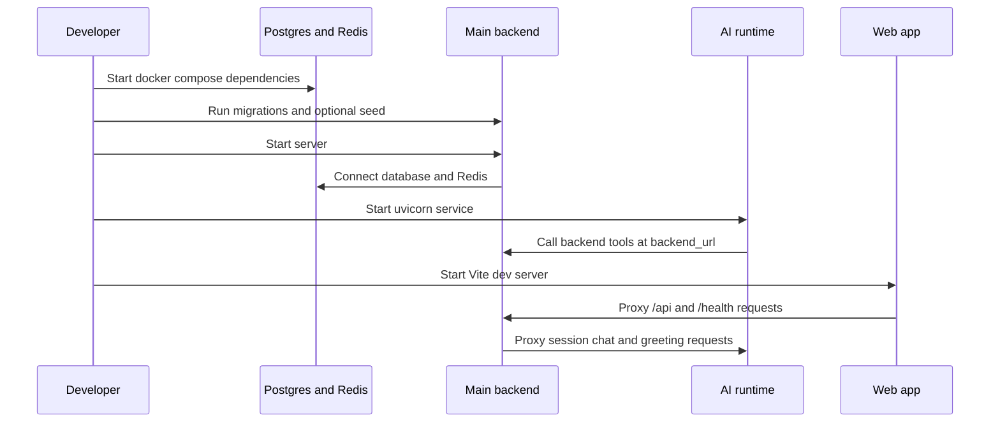

# Operations Runbook

This runbook covers the local development path that currently exists in the repository: root Turbo commands, the Go backend and its dependencies, the Python AI runtime, the web app, and the main integration pitfalls that break end-to-end testing.

## What runs where

- **Monorepo task runner:** root `pnpm` scripts call Turbo tasks from `/package.json` and `/turbo.json`.
- **Main backend:** Go HTTP server in `services/main-backend/cmd/retail/main.go` with wiring in `internal/bootstrap/bootstrap.go`.
- **Backend dependencies:** PostgreSQL and Redis, usually started from `services/main-backend/docker-compose.yml`.
- **AI runtime:** FastAPI service in `services/ai-runtime`, started with `uvicorn`.
- **Web app:** Vite dev server in `apps/web`, defaulting to port `3001` and proxying `/api`, `/health`, and `/swagger` to the backend.
- **Mobile app:** Expo app in `apps/mobile`; useful for local client work, but the most complete end-to-end local flow in this repo is web plus backend plus AI runtime.

## Startup order

For the fewest false failures, start services in this order:

1. **Postgres and Redis**
2. **Run backend migrations**
3. **Optionally run backend seeders**
4. **Start the Go backend**
5. **Start the AI runtime**
6. **Start the web app**


Caption: Local end-to-end flow starts infra first, then backend, then AI runtime, then web.

If the backend starts before Postgres or Redis are healthy, startup fails during bootstrap because the server creates database, cache, and job clients before serving requests. If the AI runtime starts without its required provider key, it fails while loading settings.

## Root monorepo commands

From the repository root:

- `pnpm dev` — run Turbo `dev`
- `pnpm build` — run Turbo `build`
- `pnpm check-types` — run Turbo `check-types`
- `pnpm dev:web` — run only the web app task
- `pnpm dev:mobile` — run only the mobile app task
- `pnpm dev:server` — run the server task selected by Turbo
- `pnpm dev:server:docker` — run the server Docker task selected by Turbo
- `pnpm check` / `pnpm fix` — run Ultracite checks or fixes

Turbo marks `dev` as persistent and non-cached, while `build` depends on upstream package builds and treats `.env*` files as inputs.

## Backend dependencies

Use `services/main-backend/docker-compose.yml` for the backend support stack.

### What the compose file provides

- **Postgres** at `127.0.0.1:5432`
  - image: `pgvector/pgvector:pg16`
  - database/user/password defaults are all `app`
  - health check uses `pg_isready`
- **Redis** at `127.0.0.1:6379`
  - image: `redis:8.8.0-alpine`
  - persistence enabled with `--appendonly yes`
  - health check uses `redis-cli ping`
- **Optional containerized app stack**
  - `server` publishes `127.0.0.1:18080:8080`
  - `worker` runs `/worker`
  - both wait for healthy Postgres and Redis

### Typical dependency commands

From `services/main-backend/package.json`:

- `pnpm --filter @shopwise/main-backend dev:deps` — start only Postgres and Redis detached and wait for health
- `pnpm --filter @shopwise/main-backend dev:docker` — build and run the compose app stack
- `pnpm --filter @shopwise/main-backend docker:down` — stop containers and remove volumes

`infra/docker-compose.yml` is currently empty, so the backend-local compose file is the one with actual service definitions.

## Main backend

### Entry points and scripts

The backend package exposes these main local workflows:

- `dev` — custom dev script for local backend work
- `dev:app` — `run ./cmd/retail`
- `dev:worker` — `run ./cmd/worker`
- `dev:deps` — boot Postgres and Redis only
- `dev:docker` — boot compose services
- `seed` — run `./cmd/seed`
- `test`, `test:unit`, `test:integration`, `test:race`
- `swagger:gen` — regenerate Swagger from Go annotations

The server binary entrypoint is `services/main-backend/cmd/retail/main.go`. It supports:

- normal server startup
- `-migrate` to run bootstrap migrations and exit
- `-seed` to run bootstrap metadata seeding and exit

### What bootstrap does

`internal/bootstrap/bootstrap.go` loads config, then connects and wires:

- database connection
- Redis cache client
- Redis-backed job client
- identity, users, orders, decision memory, accessories, files, resume-session, store, catalog, admin, and promotions handlers and services
- `/health`
- `/api/v1/...` routes

The backend only starts listening after that wiring succeeds.

### Backend environment shape

Use `services/main-backend/.env.example` as the non-secret reference. The current shape includes:

- **HTTP and runtime mode**
  - `PORT` default `18080`
  - `GIN_MODE` default development-friendly mode in local examples
  - `LOG_LEVEL`
  - `APP_NAME`
- **Browser integration**
  - `ALLOWED_ORIGINS`
  - `WEB_APP_URL`
- **Storage and infrastructure**
  - `DATABASE_URL`
  - `REDIS_URL`
  - `STORAGE_PATH`
- **Identity**
  - `JWT_SECRET`
  - `JWT_ACCESS_TTL`
  - `JWT_REFRESH_TTL`
  - optional Google OAuth values
- **AI integration**
  - `AI_RUNTIME_URL`
- **Optional integrations**
  - `PHONGVU_CONNECTOR_ENABLED`
  - `ZALO_OA_ID`
  - `ZALO_API_TOKEN`
  - SMTP settings
  - Langfuse keys and host are also read by config even though they are not listed in `.env.example`

Keep real secrets out of docs and out of committed env files.

### Config behaviors that matter in dev

- Config first loads `.env`, then falls back to `.env.example` if `DATABASE_URL` or `REDIS_URL` are still missing.
- `DATABASE_URL`, `REDIS_URL`, and `JWT_SECRET` are required; backend startup fails if they are absent.
- `AI_RUNTIME_URL` defaults to `http://localhost:8000`.
- `GOOGLE_REDIRECT_URI` defaults to `http://localhost:18080/api/v1/identity/google/callback`.
- `ALLOWED_ORIGINS` is parsed as a comma-separated list.

### Debug-only toggle: `CHECKOUT_AUTH_BYPASS`

`CHECKOUT_AUTH_BYPASS` is intentionally fail-closed outside debug mode.

- Config parses it as a boolean.
- The value only becomes active when `GIN_MODE` equals `debug`.
- When enabled, bootstrap calls `orderH.WithDevelopmentAuthBypass()` before checkout routes are served.
- Tests explicitly verify that the bypass is enabled in debug mode, disabled in release mode, and rejected if the env value is not a valid boolean.

Treat this as a local troubleshooting switch only. If checkout works only with bypass enabled, your auth setup is still broken.

### Migrations and seeding

There are two distinct seeding paths in the backend codebase.

#### 1. Bootstrap migration and metadata seed path

`cmd/retail/main.go` supports:

```bash
node ./scripts/with-go-env.mjs run ./cmd/retail -migrate
node ./scripts/with-go-env.mjs run ./cmd/retail -seed
```

`bootstrap.Migrate()` currently runs migrations for:

- users
- identity
- orders
- decision memory
- accessories catalog
- resume session
- promotions

`bootstrap.Seed()` does not load demo products. It only ensures startup metadata with `database.EnsureStartupKey(...)`.

#### 2. Demo product seed path

The package script named `seed` runs `./cmd/seed`, which:

- reads `cmd/seed/products/seed_products_demo.json`
- converts product prices into rounded VND demo prices
- upserts products by `id`
- updates SKU, name, brand, category, price, specifications, and metadata on conflict

That distinction is easy to miss:

- `./cmd/retail -seed` seeds **startup metadata only**
- `pnpm --filter @shopwise/main-backend seed` seeds **demo products**

For a fresh local catalog, you often want both migrations and the demo product seed script.

## Backend health checks and quick validation

The backend exposes `GET /health`.

Behavior:

- pings the database
- pings Redis with a 3 second timeout context
- returns HTTP `200` with status `ok` only when both are healthy
- returns HTTP `503` with status `degraded` when either dependency is failing

Useful checks after startup:

- `GET http://localhost:18080/health`
- `GET http://localhost:3001/health` through the web dev proxy
- `GET http://localhost:18080/swagger/index.html` if Swagger assets are being served in your local build

## AI runtime

### Runtime basics

The AI runtime is a FastAPI service in `services/ai-runtime`.

Quickstart from its README:

```bash
cd services/ai-runtime
uv run uvicorn src.main:app --reload --port 8000
uv run pytest
```

The Python project requires:

- Python `>=3.11`
- `uv`
- FastAPI, Uvicorn, Pydantic settings, LangGraph, OpenAI, SSE support, and test tooling from `pyproject.toml`

### AI runtime environment shape

The runtime settings currently read from `services/ai-runtime/.env` and include:

- `OPENAI_API_KEY` — required secret value
- `MODEL` with default `gpt-5.4-mini`
- `OPENAI_BASE_URL` optional override
- `BACKEND_URL` default `http://localhost:18080`
- `HOST` default `0.0.0.0`
- `PORT` default `8000`
- `ENVIRONMENT` default `development`

The important operational rule is that settings are instantiated at import time, and `openai_api_key` has no default. In practice, the AI runtime fails to boot until that key is present.

### AI runtime endpoints and behavior

`src.main` mounts the chat router under `/api/v1` and exposes `GET /health` returning `{"status": "ok"}`.

Current AI endpoints include:

- `POST /api/v1/chat`
- `POST /api/v1/chat/stream`
- `POST /api/v1/greeting`

The runtime also adds an `X-Process-Time` response header via middleware and wraps uncaught exceptions in a JSON `500` error response.

### AI runtime integration direction

The AI runtime does not directly own catalog state. Its tool proxy points at `BACKEND_URL`, defaulting to `http://localhost:18080`, so runtime workflows call back into backend HTTP endpoints for tool-backed data.

That means full chat debugging is bidirectional:

- backend session handlers proxy user chat requests to the AI runtime
- AI runtime tools call back into the backend for catalog and related data

If either side is pointed at the wrong base URL, chat may fail even though each process is individually healthy.

## Web app local run

The web package uses Vite:

- start script: `vite`
- `dev:bare`: `vite dev`
- dev server port: `3001`

`apps/web/vite.config.ts` sets `http://localhost:18080` as the default backend target and proxies:

- `/api`
- `/health`
- `/swagger`

For normal local development, a working setup is:

1. backend on `18080`
2. AI runtime on `8000`
3. web on `3001`

Then access the frontend at `http://localhost:3001` and let Vite proxy API traffic.

## Mobile app local run

The mobile package is an Expo app. Main scripts are:

- `pnpm --filter mobile start`
- `pnpm --filter mobile dev`
- `pnpm --filter mobile android`
- `pnpm --filter mobile ios`
- `pnpm --filter mobile web`

This page does not enumerate mobile-specific backend env wiring because the assigned repository evidence is centered on backend and web local operations.

## Known local footguns and mismatches

### 1. Two different backend seed concepts

The package-level `seed` script and the server `-seed` flag do different jobs. Use the right one for the state you need.

### 2. `CHECKOUT_AUTH_BYPASS` only works in debug mode

If `CHECKOUT_AUTH_BYPASS=true` seems ignored, check `GIN_MODE`. Release mode disables the bypass even when the env var is set.

### 3. Container port mapping can mislead people

In `services/main-backend/docker-compose.yml`, the `server` container publishes `127.0.0.1:18080:8080` while the Go app itself is configured by `PORT` and local `.env.example` defaults to `18080`. The effect is that host traffic uses `18080`, but the containerized process is listening on container port `8080`.

When debugging container issues, verify both the host port and the in-container port assumptions.

### 4. `infra/docker-compose.yml` is empty

If you expect a top-level infra stack, there is none in that file right now.

### 5. AI runtime and backend must agree on base URLs

Current defaults are aligned:

- backend `AI_RUNTIME_URL` default: `http://localhost:8000`
- AI runtime `BACKEND_URL` default: `http://localhost:18080`

But end-to-end chat breaks quickly if either side is overridden without updating the other service or your local ports.

### 6. AI runtime startup can fail before the first request

Because settings are created at import time and the OpenAI key is required, missing provider env causes boot failure rather than a later request-time error.

### 7. Health checks do not prove full AI chat readiness

- backend `/health` only checks DB and Redis
- AI runtime `/health` only returns static service status

A green pair of health checks does **not** confirm that:

- AI provider credentials are valid
- backend-to-runtime chat proxying works
- runtime-to-backend tool calls work
- product/demo seed data exists

## Recommended local verification checklist

After starting your stack, verify in this order:

1. **Dependencies**
   - Postgres healthy on `5432`
   - Redis healthy on `6379`
2. **Backend**
   - `GET /health` returns `200`
   - migrations have been run
   - if needed, demo product seed has been run
3. **AI runtime**
   - `GET /health` returns `200`
   - required AI env is present
4. **Web**
   - frontend loads on `3001`
   - `/health` through Vite proxy reaches backend
5. **Chat flow**
   - backend session chat reaches AI runtime
   - AI runtime can call backend tools
6. **Checkout flow**
   - test with and without bypass expectations understood

## Practical command sequence

A typical local session looks like this:

```bash
pnpm --filter @shopwise/main-backend dev:deps
pnpm --filter @shopwise/main-backend dev:app -- -migrate
pnpm --filter @shopwise/main-backend seed
pnpm --filter @shopwise/main-backend dev:app
cd services/ai-runtime && uv run uvicorn src.main:app --reload --port 8000
pnpm dev:web
```

Adjust the exact shell usage to your environment, but preserve the ordering: infra first, then schema/data setup, then backend, then AI runtime, then web.

## When debugging, trust these files first

- `package.json`
- `turbo.json`
- `services/main-backend/package.json`
- `services/main-backend/.env.example`
- `services/main-backend/docker-compose.yml`
- `services/main-backend/cmd/retail/main.go`
- `services/main-backend/internal/bootstrap/bootstrap.go`
- `services/main-backend/internal/platform/config/config.go`
- `services/ai-runtime/README.md`
- `services/ai-runtime/src/core/config.py`
- `services/ai-runtime/src/main.py`
- `services/ai-runtime/src/api/chat.py`
- `apps/web/vite.config.ts`

Those files reflect the current operational truth more reliably than older scaffold prose.
