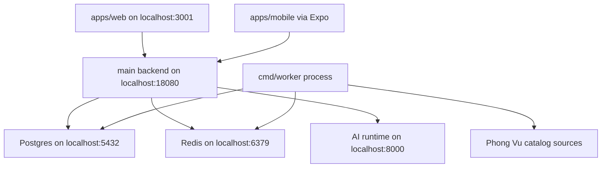
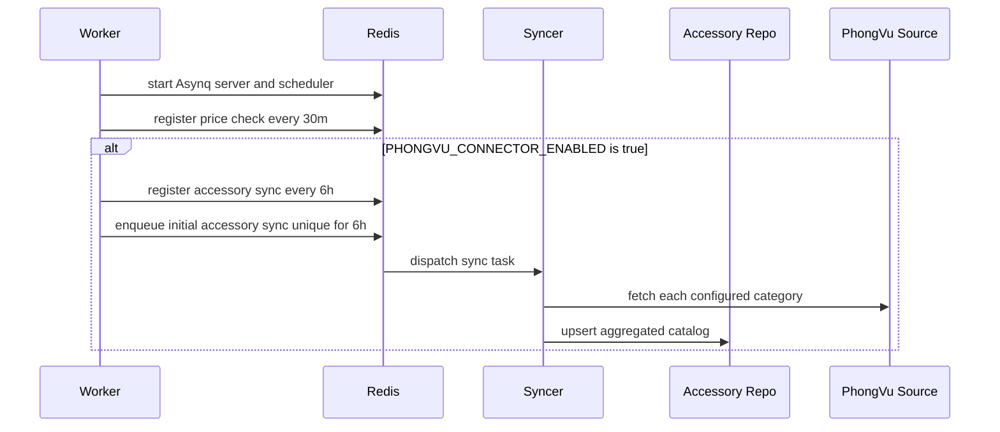

# Operations and Runbook

This runbook focuses on how to operate the current SHOPWISE stack in local development and the repository’s partial deployment setup. The active runtimes are a Vite web app, an Expo mobile app, a Go backend HTTP server, a separate Go worker process backed by Redis, and a Python FastAPI AI runtime.

## Runtime map and startup order

The stack is easiest to reason about as two planes:

- **User-facing clients:** `apps/web` and `apps/mobile`
- **Service plane:** `services/main-backend`, `services/ai-runtime`, Postgres, Redis, and the optional worker process


```mermaid
flowchart TD
    Web["apps/web on localhost:3001"] --> Backend["main backend on localhost:18080"]
    Mobile["apps/mobile via Expo"] --> Backend
    Backend --> Postgres["Postgres on localhost:5432"]
    Backend --> Redis["Redis on localhost:6379"]
    Backend --> AIRuntime["AI runtime on localhost:8000"]
    Worker["cmd/worker process"] --> Redis
    Worker --> Postgres
    Worker --> PhongVu["Phong Vu catalog sources"]
```
Caption: Local runtime dependencies and the primary operational connections between clients, services, and stateful infrastructure.

For a full-stack local session, use this startup order:

1. Start **Postgres** and **Redis**.
2. Start the **main backend**.
3. Start the **worker** if you need scheduled jobs or accessory sync behavior.
4. Start the **AI runtime** before testing session chat or greeting flows.
5. Start the **web app** and optionally the **mobile Expo app**.

That order matches the code-level dependencies: the backend and worker both require `DATABASE_URL` and `REDIS_URL`, while chat flows in the backend proxy to the AI runtime URL.

## Monorepo entrypoints

From the repository root:

- `pnpm dev` runs the Turborepo development pipeline.
- `pnpm build` builds configured packages and apps.
- `pnpm check-types` runs the monorepo type-check pipeline.
- `pnpm dev:web` starts only the web app.
- `pnpm dev:mobile` starts the Expo mobile app.
- `pnpm dev:server` starts the backend package’s dev flow.
- `pnpm dev:server:docker` starts the backend package Docker stack.
- `pnpm deploy` and `pnpm destroy` target the Alchemy-managed web deployment.
- `pnpm check` / `pnpm fix` run Ultracite checks and autofixes.

The backend package itself exposes the operational commands that matter most day to day:

- `pnpm --filter @shopwise/main-backend dev:deps` starts only Postgres and Redis via Docker Compose and waits for health checks.
- `pnpm --filter @shopwise/main-backend dev:app` runs `./cmd/retail`.
- `pnpm --filter @shopwise/main-backend dev:worker` runs `./cmd/worker`.
- `pnpm --filter @shopwise/main-backend dev:docker` builds and runs the backend Docker Compose stack.
- `pnpm --filter @shopwise/main-backend seed` runs the dedicated product seed program.
- `pnpm --filter @shopwise/main-backend swagger:gen` regenerates Swagger from Go annotations.

## Local infrastructure

`services/main-backend/docker-compose.yml` is the actual local infra definition in use. It provisions:

- **Postgres** from `pgvector/pgvector:pg16` on `127.0.0.1:5432`
- **Redis** on `127.0.0.1:6379` with append-only persistence
- **server** exposed as `127.0.0.1:18080:8080`
- **worker** as a separate container running `command: ["/worker"]`

The root `infra/docker-compose.yml` currently has no content, so operational automation should not assume it is the canonical local stack definition.

### Why port `18080` matters

The repository deliberately uses `18080` for the backend instead of host `8080`. The root README calls out a Windows and WSL conflict where `wslrelay` can hijack `localhost:8080` and reset connections. In Docker, the backend container still listens on `8080` internally, but the host mapping stays on `18080`.

When debugging “backend unreachable” reports, verify whether the caller is using:

- `http://localhost:18080` on the host, or
- `:8080` only inside the container network

## Running each runtime locally

### Web app

The web app lives in `apps/web`, runs on port `3001`, and proxies `/api`, `/health`, and `/swagger` to the configured backend URL. If `VITE_SERVER_URL` is unset, Vite falls back to `http://localhost:18080`.

Typical entrypoint:

```bash
pnpm dev:web
```

Operational expectations:

- Browser entry URL: `http://localhost:3001`
- Backend target: `VITE_SERVER_URL`, defaulting to `http://localhost:18080`
- For deployment, `packages/infra/alchemy.run.ts` requires `VITE_SERVER_URL` and binds it into the Cloudflare-hosted web artifact.

### Mobile app

The mobile app lives in `apps/mobile` and uses Expo scripts such as `expo start` and `expo start --clear`.

Typical setup:

```bash
cp apps/mobile/.env.example apps/mobile/.env
pnpm --filter mobile dev
```

The main runtime-specific variable surfaced in the example file is:

- `EXPO_PUBLIC_SERVER_URL=http://localhost:18080`

Use a device-reachable backend URL instead of `localhost` when testing on physical hardware.

### Main backend

The main HTTP service starts from `services/main-backend/cmd/retail/main.go`, which either:

- runs migrations with `-migrate`
- seeds startup metadata with `-seed`
- or starts the HTTP server through `bootstrap.Run()`

Typical local flow:

```bash
pnpm --filter @shopwise/main-backend dev:deps
pnpm --filter @shopwise/main-backend dev:app
```

Health and docs endpoints:

- `GET /health`
- Swagger UI in debug mode at `http://localhost:18080/swagger/index.html`

The backend bootstraps database, Redis, the async job client, file storage, auth, orders, promotions, decision memory, accessories, resume session support, and all HTTP routes in one process.

### Worker

The worker is a separate Go binary under `services/main-backend/cmd/worker`. It is not optional if you need background processing semantics rather than only synchronous HTTP behavior.

Typical local entrypoint:

```bash
pnpm --filter @shopwise/main-backend dev:worker
```

The worker:

- connects to the same Postgres and Redis instances as the backend
- runs an Asynq server with the `default` queue
- runs an Asynq scheduler in the same process
- handles order confirmation jobs
- schedules recurring jobs, including price checks and optional accessory sync

### AI runtime

The AI runtime is a Python FastAPI service under `services/ai-runtime`.

Typical local flow:

```bash
cd services/ai-runtime
uv run uvicorn src.main:app --reload --port 8000
```

Tests:

```bash
uv run pytest
```

Operational expectations:

- Default bind port: `8000`
- Backend integration target: `AI_RUNTIME_URL`, defaulting to `http://localhost:8000`
- Backend chat streaming proxy target: `/api/v1/chat/stream`
- Runtime endpoints include `/api/v1/chat`, `/api/v1/chat/stream`, and `/api/v1/greeting`

## Environment variables by runtime

This section highlights the variables that most affect operations, rather than restating every example file.

### Backend and worker environment

The backend config loader reads `.env` first and falls back to `.env.example` when `DATABASE_URL` or `REDIS_URL` are missing, so local defaults can silently come from the example file. That is convenient for development, but it also means debugging should begin by checking both files.

The highest-impact backend variables are:

- `PORT`: defaults to `18080`
- `GIN_MODE`: defaults to `debug`
- `DATABASE_URL`: required
- `REDIS_URL`: required
- `JWT_SECRET`: required
- `ALLOWED_ORIGINS`: comma-separated CORS allowlist, default `http://localhost:3001`
- `WEB_APP_URL`: default `http://localhost:3001`
- `AI_RUNTIME_URL`: default `http://localhost:8000`
- `CHECKOUT_AUTH_BYPASS`: parsed as boolean, but only effective in debug mode
- `PHONGVU_CONNECTOR_ENABLED`: gates worker accessory sync behavior
- `STORAGE_PATH`: local file upload path
- optional integration settings for Google OAuth, Zalo, SMTP, and Langfuse

### Web environment

The web app mainly cares about:

- `VITE_SERVER_URL`: backend base URL for Vite proxying and deployment binding
- `VITE_NODE_ENV`: environment label used by the web app

### Mobile environment

The mobile app currently exposes:

- `EXPO_PUBLIC_SERVER_URL`: backend base URL for Expo clients

### AI runtime environment

The AI runtime settings include:

- `openai_api_key`: required, with no fallback default
- `model`: defaults to `gpt-5.4-mini`
- `openai_base_url`: optional provider override
- `backend_url`: defaults to `http://localhost:18080`
- `host`, `port`, and `environment` for FastAPI serving

A missing OpenAI API key prevents normal provider-backed operation because `get_provider()` constructs the OpenAI provider from `settings.openai_api_key`.

## Migrations and seeding

There are two distinct kinds of seed-like operations in the backend package, and they do different things.

### Schema migrations and startup metadata

The retail server binary supports flags for operational bootstrap tasks:

```bash
node ./scripts/with-go-env.mjs run ./cmd/retail -migrate
node ./scripts/with-go-env.mjs run ./cmd/retail -seed
```

Those map to `bootstrap.Migrate()` and `bootstrap.Seed()`.

`bootstrap.Migrate()` currently runs migrations for:

- users
- identity
- orders
- decision memory
- accessory catalog
- resume session
- promotions

`bootstrap.Seed()` only ensures startup metadata through `database.EnsureStartupKey(...)`; it is not the bulk product catalog seed.

### Demo product seeding

The backend package’s `seed` script runs the separate `cmd/seed` program, which reads `cmd/seed/products/seed_products_demo.json` and upserts demo products into the product table. It also normalizes prices into VND and applies a specific override for SKU `ASUS-0001`.

Use this when you need catalog data for development or demos:

```bash
pnpm --filter @shopwise/main-backend seed
```

Operationally, this means “run seed” can refer to two different entrypoints. Be explicit in team communication about whether you mean:

- `./cmd/retail -seed` for startup metadata, or
- `./cmd/seed` for demo product records

## Worker-scheduled jobs and accessory sync

The worker’s scheduled behavior matters for both correctness and debugging.


```mermaid
sequenceDiagram
    participant Worker
    participant Redis
    participant Syncer
    participant Repo as Accessory Repo
    participant Source as PhongVu Source

    Worker->>Redis: start Asynq server and scheduler
    Worker->>Redis: register price check every 30m
    alt PHONGVU_CONNECTOR_ENABLED is true
        Worker->>Redis: register accessory sync every 6h
        Worker->>Redis: enqueue initial accessory sync unique for 6h
        Redis->>Syncer: dispatch sync task
        Syncer->>Source: fetch each configured category
        Syncer->>Repo: upsert aggregated catalog
    end
```
Caption: The worker runs both queue consumers and scheduled jobs, including the gated Phong Vu accessory sync path.

Important details:

- Price-check jobs are registered every 30 minutes.
- Phong Vu accessory sync is only enabled when `PHONGVU_CONNECTOR_ENABLED=true`.
- When enabled, the worker both schedules sync every 6 hours and enqueues an initial unique sync task at startup.
- The syncer uses only a **process-local mutex** to prevent concurrent runs; the code comments explicitly note that multi-replica deployments would need a distributed lock such as Redis.
- On fetch or upsert failure, the syncer records failure state through `MarkPhongVuSyncFailure(...)` before returning the error.

This is a repository-specific gotcha: accessory refresh is not owned by the HTTP server. If accessory data looks stale, inspect the worker process first.

## Deployment notes

The only deployment path evidenced in this assignment is the web deployment under `packages/infra/alchemy.run.ts`.

That script:

- loads root `.env` and `apps/web/.env`
- requires `VITE_SERVER_URL`
- creates an Alchemy app named `shopwise`
- deploys the web artifact from `apps/web/dist`
- binds `VITE_SERVER_URL` into the Cloudflare Vite deployment

There is no parallel repository evidence here for a production deployment definition of the Go backend, worker, or AI runtime, so this runbook should treat those as locally operable services rather than fully documented deployed components.

## Common debugging and failure patterns

### Backend starts, but clients cannot connect

Check these in order:

1. Confirm the backend is listening on `18080`, not host `8080`.
2. Confirm `VITE_SERVER_URL` or `EXPO_PUBLIC_SERVER_URL` points at the real backend URL.
3. Confirm CORS settings through `ALLOWED_ORIGINS` for browser requests.
4. Confirm `/health` succeeds.

### Backend fails on boot

The config loader hard-fails if any of these are missing:

- `DATABASE_URL`
- `REDIS_URL`
- `JWT_SECRET`

Also verify that Postgres and Redis are actually healthy before starting the server or worker.

### Checkout appears to work without authentication

This is often not a security bug in production behavior. `CHECKOUT_AUTH_BYPASS` is intentionally gated to debug mode: the config loader only enables it when the parsed flag is true **and** `GIN_MODE` equals `debug`. In bootstrap, that flag then turns on development auth bypass for order handlers.

Treat any successful anonymous checkout in local development as suspicious until you verify both variables.

### Chat or greeting features fail

Check the full chain:

1. Is the AI runtime running on `8000` or does `AI_RUNTIME_URL` point somewhere else?
2. Does the AI runtime have a valid `openai_api_key`?
3. Can the backend reach `AI_RUNTIME_URL + /api/v1/chat/stream`?
4. Is the AI runtime able to reach its `backend_url` for tool calls?

A broken link in either direction can surface as chat failure.

### Accessory recommendations or external offers look stale

Check whether:

- the worker is running
- `PHONGVU_CONNECTOR_ENABLED` is enabled
- the scheduled or initial sync job has actually executed
- sync failures were recorded during fetch or upsert

Remember that sync concurrency protection is process-local only.

## Recommended local operating procedures

### Minimal backend-only development

1. `pnpm --filter @shopwise/main-backend dev:deps`
2. Set or copy backend env values, especially `JWT_SECRET`
3. Run migrations
4. Optionally run demo product seed
5. `pnpm --filter @shopwise/main-backend dev:app`

### Full-stack local development

1. Start backend dependencies
2. Start backend app
3. Start worker if background jobs matter for your scenario
4. Start AI runtime
5. Start web app
6. Start Expo mobile app if needed
7. Verify `/health` and a basic `/api/v1` call before debugging UI issues

### Before merging operationally significant changes

Re-check these boundaries:

- If you changed backend routes, confirm they are still registered in `bootstrap.Run()`.
- If you changed config usage, update `.env.example` files without adding secrets.
- If you changed AI runtime routes or payloads, verify the backend proxy caller still targets the right path.
- If you changed checkout or auth behavior, test with and without debug-mode bypass expectations.
- If you changed worker scheduling or accessory integrations, verify the worker, not just the server.
