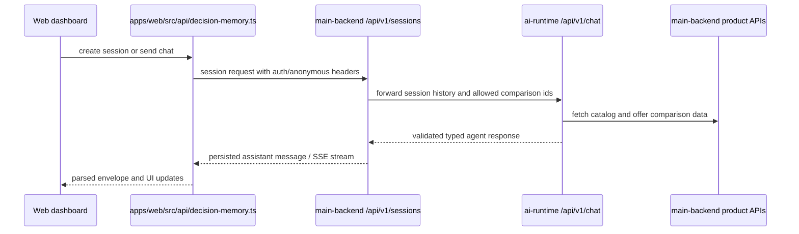

# Source Map

This repository is a monorepo split across product runtimes, service backends, shared TypeScript contracts, and a small set of infrastructure and conformance placeholders. The highest-value navigation split is:

- **Web** in `apps/web`
- **Mobile** in `apps/mobile`
- **Main backend** in `services/main-backend`
- **AI runtime** in `services/ai-runtime`
- **Shared contracts and UI packages** in `packages`
- **Local infrastructure and deployment placeholders** in `infra`, `deploy`, and `conformance`

At the workspace level, `pnpm-workspace.yaml` includes `apps/*`, `packages/*`, `services/*`, `conformance/*`, `deploy`, `infra`, and `scripts`, so those directories are all first-class package roots in day-to-day development.

## How to orient yourself quickly

For most feature work, follow this path:

1. **UI entrypoint**: start in `apps/web/src/routes` or `apps/mobile/app`
2. **Web API adapter**: check `apps/web/src/api`
3. **Backend route wiring**: inspect `services/main-backend/internal/bootstrap/bootstrap.go`
4. **Domain handler and use case**: move into the relevant `internal/<domain>` package
5. **AI conversation behavior**: if the feature is agent-driven, continue into `services/ai-runtime/src/api/chat.py` and `services/ai-runtime/src/graph/workflow.py`
6. **Shared contracts**: confirm envelope, protocol, or type expectations in `packages/protocols`, `packages/api-types`, and `packages/env`
7. **Tests**: look for Vitest files under `apps/web/src`, Go `_test.go` files under backend domains, and pytest suites under `services/ai-runtime/tests`

## Runtime domains

```mermaid
flowchart LR
  Web[apps/web] --> WebAPI[apps/web/src/api]
  Mobile[apps/mobile] --> SharedEnv[@shopwise/env]
  WebAPI --> Backend[services/main-backend]
  Backend --> AIRuntime[services/ai-runtime]
  AIRuntime --> BackendTools[main backend product and offer APIs]
  Web --> SharedPkgs[packages/*]
  Mobile --> SharedPkgs
  Backend --> Contracts[packages/protocols and api-types]
  AIRuntime --> Contracts
```

## Web runtime: `apps/web`

The web app is the primary product surface today. It is a Vite React application using TanStack Router and React Query, with shared UI primitives pulled from `@shopwise/ui` and environment access from `@shopwise/env/web`.

### Key entrypoints

- `apps/web/src/main.tsx` bootstraps the router, a single `QueryClient`, the global theme, and the shared font provider.
- `apps/web/src/routes/__root.tsx` is the real application shell: it provides tooltip support, the global toaster, the checkout incentive provider and panel, and devtools in development.
- `apps/web/src/routes/dashboard.tsx` is the most important feature route for current product behavior; it drives the shopping workspace, session state, agent interaction, comparison, checkout, and auxiliary modals.

### Highest-value directories

- `apps/web/src/routes` — route-level composition and page entrypoints.
- `apps/web/src/api` — the browser-to-backend boundary. This is where fetch calls, auth headers, anonymous-session headers, SSE parsing, and response validation live.
- `apps/web/src/features/dashboard` — the current orchestration hotspot for the shopping assistant experience.
- `apps/web/src/features/orders` — order history and related post-checkout UI.
- `apps/web/src/features/errors` — route-level failure surfaces.
- `apps/web/src/test` and adjacent `*.test.ts(x)` files — focused UI and API contract tests.

### What matters architecturally

`apps/web/src/api/decision-memory.ts` is the most important adapter for agent-backed flows. It:

- attaches bearer auth if present,
- creates and persists an anonymous session ID in `localStorage`,
- calls `/api/v1/sessions` backend endpoints,
- validates agent envelopes with Zod,
- supports both one-shot and streamed chat,
- and carries dynamic UI interaction requests typed from `@shopwise/protocols`.

That makes it the practical seam between the dashboard route and the backend session/AI stack.

### Representative tests

Good first reads when changing web behavior:

- `apps/web/src/api/decision-memory.test.ts`
- `apps/web/src/api/dynamic-ui-protocol.test.ts`
- `apps/web/src/api/dynamic-ui-schema.test.ts`
- `apps/web/src/routes/resume.test.tsx`
- `apps/web/src/features/dashboard/**/*.test.tsx`

## Mobile runtime: `apps/mobile`

The mobile app is an Expo / React Native app. Compared with the web app, it currently looks more like a starter shell than a feature-complete shopping client, so it is important to treat it as a separate runtime with shared foundations rather than a mirror of web behavior.

### Key entrypoints

- `apps/mobile/app/_layout.tsx` wraps the app in `GestureHandlerRootView`, `KeyboardProvider`, `AppThemeProvider`, and `HeroUINativeProvider`, then mounts the Expo Router stack.
- `apps/mobile/app/(drawer)/_layout.tsx` defines the drawer shell and the main navigable mobile sections.
- `apps/mobile/app/(drawer)/index.tsx` is the current home screen.
- `apps/mobile/package.json` shows the runtime commands: `expo start`, `expo run:android`, `expo run:ios`, and `expo start --web`.

### Highest-value directories

- `apps/mobile/app` — Expo Router screens and layout hierarchy.
- `apps/mobile/components` — shared mobile UI building blocks.
- `apps/mobile/contexts` — app-level state and theme context.
- `apps/mobile/assets` — static mobile assets.

### What matters architecturally

The mobile runtime already consumes shared workspace packages such as `@shopwise/env`, but it does not yet expose the same assistant and commerce feature density as the web app. When adding cross-platform behavior, verify whether the contract should live in `packages/*` first instead of being copied from web-only code.

## Main backend: `services/main-backend`

This Go service is the central HTTP backend for web and mobile clients. It is a modular monolith: `cmd/retail/main.go` handles process startup flags, while `internal/bootstrap/bootstrap.go` wires infrastructure, domain services, HTTP routes, and graceful shutdown.

### Operational entrypoints

- `services/main-backend/cmd/retail/main.go` starts the server by default and also supports `-migrate` and `-seed` execution paths.
- `services/main-backend/internal/bootstrap/bootstrap.go` loads config, connects Postgres and Redis, creates a job client, wires domain repositories and services, registers `/api/v1` routes, starts the HTTP server, and coordinates shutdown.
- `services/main-backend/package.json` is the operational command map for local work: app, worker, dependency containers, build, Swagger generation, and tests.

### Highest-value backend domains

- `internal/decision_memory` — shopping sessions, stored message history, preferences, branching, and the proxy boundary to AI runtime chat endpoints.
- `internal/resume_session` — resume-token issuance and provider-backed notification flow.
- `internal/orders` — checkout flow, order persistence, retailer offer refresh, and order confirmation wiring.
- `internal/identity` and `internal/users` — authentication, Google OAuth, JWT handling, and user lifecycle.
- `internal/catalog` and `internal/accessories` — product and accessory retrieval surfaces consumed by the AI runtime and UI.
- `internal/promotions` — promotion and voucher behavior connected into checkout handling.
- `internal/platform` — infrastructure concerns such as config, cache, database, logger, middleware, router, health checks, and job clients.
- `internal/ui-protocol` — Go-side dynamic UI document and interaction models.

### Route ownership and control flow

`internal/bootstrap/bootstrap.go` is the authoritative route map. The most important route groups are:

- `/api/v1/identity`
- `/api/v1/users`
- `/api/v1/checkout` and `/api/v1/orders`
- `/api/v1/files`
- `/api/v1/products`
- `/api/v1/accessories`
- `/api/v1/stores`
- `/api/v1/sessions`
- `/api/v1/session`
- `/api/v1/admin`

This is also where important runtime relationships become visible:

- the backend constructs `decision_memory` handlers with `cfg.AIRuntimeURL`, so the Go service is the caller of the Python AI runtime,
- order services are augmented with retailer offer refresh and order-confirmation job behavior,
- promotions are attached as a sink to checkout/order flows,
- and admin routes are rate-limited separately.

### Important behavior seams

If you are changing a feature, these files are usually the fastest path:

- **Server wiring**: `internal/bootstrap/bootstrap.go`
- **Decision-memory HTTP behavior**: `internal/decision_memory/handler/handler.go` and `internal/decision_memory/handler/chat.go`
- **Decision-memory business rules**: `internal/decision_memory/usecase`
- **Resume tokens and notification retries**: `internal/resume_session/usecase`
- **Checkout and orders**: `internal/orders/handler` and `internal/orders/usecase`
- **Dynamic UI contracts in Go**: `internal/ui-protocol/*.go`

### Backend test locations

The backend has dense domain-local Go tests. High-signal areas include:

- `internal/decision_memory/handler/chat_test.go` for AI runtime forwarding, session ownership checks, SSE pass-through, and assistant-response persistence.
- `internal/platform/testutil/contract/openapi_test.go` for OpenAPI and Swagger contract coverage.
- domain tests under `internal/orders`, `internal/identity`, `internal/users`, `internal/promotions`, and `internal/accessories`.

## AI runtime: `services/ai-runtime`

This Python FastAPI service is the structured LLM runtime. It is stateless with respect to conversation storage: callers provide the session history each turn, and the runtime uses backend tools to hydrate products and offer data before asking the model for a schema-constrained response.

### Key entrypoints

- `services/ai-runtime/src/main.py` creates the FastAPI app, adds request-latency logging middleware, installs a global exception handler, mounts the chat router under `/api/v1`, and exposes `/health`.
- `services/ai-runtime/src/api/chat.py` defines the greeting, chat, and streaming chat endpoints.
- `services/ai-runtime/src/graph/workflow.py` defines the LangGraph workflow that loads tool data, invokes the model, validates and hydrates responses, and retries on schema-validation failure.
- `services/ai-runtime/src/tools/interfaces.py` is the backend tool adapter for product catalog and offer-comparison calls.
- `services/ai-runtime/README.md` summarizes the conversation contract, statelessness, quickstart, and test commands.

### Highest-value directories

- `src/api` — HTTP contract surface.
- `src/graph` — orchestration and retry logic.
- `src/models` — schema objects and response hydration.
- `src/llm` — provider abstraction and OpenAI implementation.
- `src/tools` — backend tool bridge.
- `src/core` — config, prompts, and observability.
- `tests/unit` and `tests/integration` — schema, provider, workflow, streaming, tool proxy, and endpoint coverage.

### Control flow that matters

The runtime is not a generic chat proxy. The important steps are:

1. `chat.py` creates a workflow with an LLM provider and a `ToolProxy` pointed at the backend.
2. `workflow.py` loads the backend catalog every turn and fetches allowed offer comparisons for any explicitly allowed comparison IDs.
3. The workflow sends a schema-constrained prompt to the model.
4. The runtime validates the returned JSON as an `AgentDraft`, hydrates it with backend-owned product and offer data, and returns a typed `AgentResponse`.
5. If validation fails, the workflow feeds the validation error back into the model and retries up to the self-correction limit.
6. The streaming endpoint wraps the same logical response flow in SSE events.

This division is important when debugging incorrect prices or IDs: the model is not supposed to invent them, because backend tool data is used to hydrate the final response.

### Representative tests

Start with:

- `services/ai-runtime/tests/unit/test_graph.py`
- `services/ai-runtime/tests/unit/test_self_correction.py`
- `services/ai-runtime/tests/unit/test_tool_proxy.py`
- `services/ai-runtime/tests/unit/test_streaming.py`
- `services/ai-runtime/tests/integration/test_chat_endpoint.py`

## Shared packages and contracts: `packages`

The `packages` workspace is where reusable frontend building blocks and shared TypeScript contracts live. Not every package is equally mature, so prioritize the ones that are visibly consumed by apps and services.

### Highest-value packages

- `packages/ui` — shared UI package exporting styles, components, hooks, and contexts used by the web app.
- `packages/env` — validated environment access split by `./web` and `./mobile` exports.
- `packages/api-types` — shared API-facing TypeScript surfaces, including identity and promotions exports.
- `packages/protocols` — dynamic UI component, operation, envelope, and interaction request contracts plus `applyUIOperations` client logic.

### Supporting or lower-maturity packages

- `packages/config` — shared configuration support for workspace tooling.
- `packages/generated` — generated artifacts when present.
- `packages/infra` — package-level infrastructure helpers referenced by other workspace packages.
- `packages/sdk`, `packages/schemas`, `packages/types`, `packages/ui-protocol` — currently light or placeholder package roots that are likely intended to absorb future shared contracts or SDK logic.

### Contract boundaries to know

- `@shopwise/ui` is the reusable component and style surface for web.
- `@shopwise/env` keeps runtime-specific environment exports separate for web and mobile.
- `@shopwise/protocols` defines the dynamic UI vocabulary used by the web app for interaction requests and UI operation application.
- `@shopwise/api-types` is the shared TypeScript home for API data shapes that should not be re-declared in apps.

## Deployment and infrastructure: `infra` and `deploy`

These roots exist as workspace packages, but they are currently much thinner than the product runtimes.

### `infra`

- `infra/docker-compose.yml` currently exists but is empty in the repository snapshot.
- `infra/package.json` marks the root as a private workspace package.

Treat `infra` as a placeholder package root rather than a mature source of operational truth unless other docs or future commits populate it.

### `deploy`

- `deploy/package.json` exists as a private workspace package.

As with `infra`, this currently reads as deployment scaffolding rather than a fully implemented deployment module. Check the root scripts and external deployment docs before assuming ownership lives here.

## Conformance placeholders: `conformance`

The `conformance` directory is organized into package roots for future or externalized verification suites:

- `conformance/retail-sdk`
- `conformance/tool-sdk`
- `conformance/ui-protocol`

Each currently contains only a minimal private `package.json` plus `.gitkeep`, so the repository shape reserves these ownership boundaries without yet providing substantive test implementations there. Use them as extension points, not current sources of behavior.

## Cross-runtime relationships that matter

### Shopping assistant request path



### Shared invariants

- **Web and backend share session ownership rules** through bearer auth and `X-Anonymous-ID` usage.
- **Backend owns durable state** such as sessions, orders, users, promotions, and resume tokens.
- **AI runtime owns structured reasoning and schema-constrained response generation**, but not canonical catalog or offer facts.
- **Shared TypeScript packages own browser-side contracts and reusable components**, not backend persistence rules.
- **Conformance, deploy, and infra roots are presently scaffolding-heavy**, so most implementation truth lives in apps, services, and actively consumed packages.

## Best first reads by change type

- **Dashboard or assistant UI**: `apps/web/src/routes/dashboard.tsx`, then `apps/web/src/api/decision-memory.ts`
- **Session persistence or resume behavior**: `services/main-backend/internal/decision_memory` and `services/main-backend/internal/resume_session`
- **Catalog, comparison, or offer data**: `services/main-backend/internal/catalog`, `internal/accessories`, and `services/ai-runtime/src/tools/interfaces.py`
- **LLM prompt and schema behavior**: `services/ai-runtime/src/api/chat.py`, `src/graph/workflow.py`, and `src/models`
- **Dynamic UI contract changes**: `packages/protocols/src/index.ts`, `services/main-backend/internal/ui-protocol`, and web dynamic UI tests
- **Cross-platform environment or shared UI work**: `packages/env` and `packages/ui`
- **Operational startup or route discovery**: `services/main-backend/internal/bootstrap/bootstrap.go` and runtime READMEs
