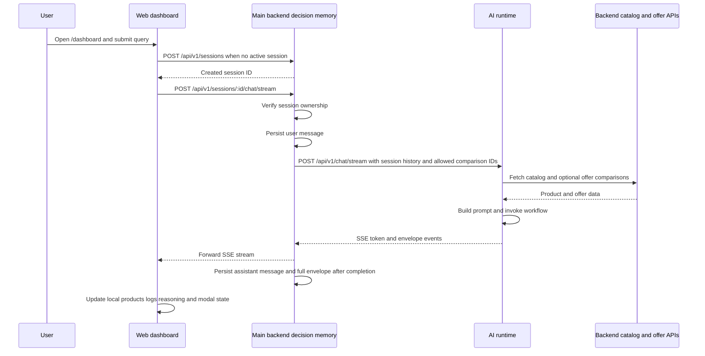
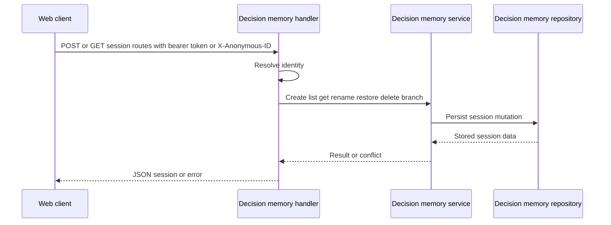
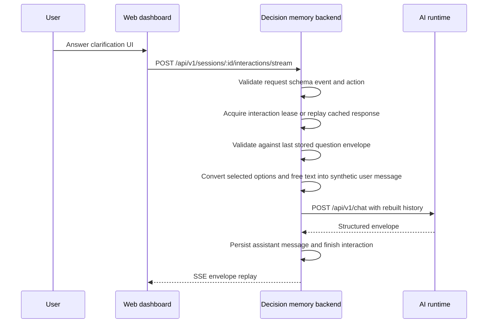
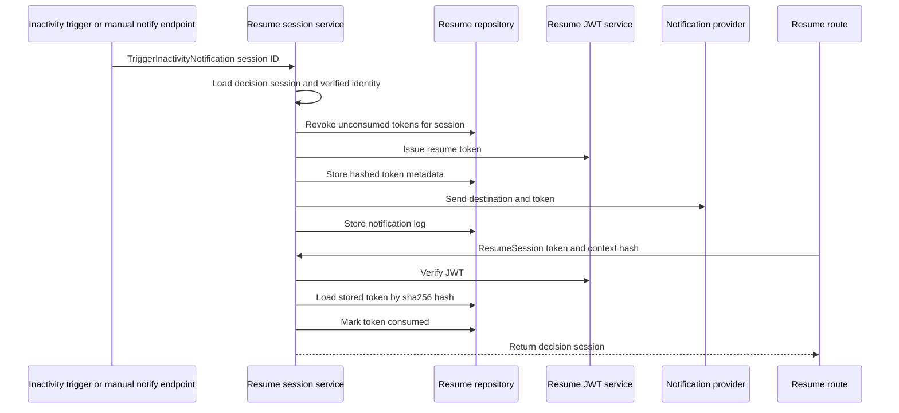

# Key Workflows

This page traces the cross-system workflows that matter today and calls out where the specifications describe a broader target than the current implementation actually delivers.

## Current system boundaries

The main flows span three runtime surfaces:

- **Web app**: the landing page at `/` and the interactive workspace at `/dashboard`.
- **Main backend**: owns decision sessions, session messages, interaction deduplication, resume-token persistence, notification triggering, catalog/offer endpoints, and checkout/order APIs.
- **AI runtime**: stateless request processor that loads catalog and offer data from the backend, asks the LLM for structured JSON, and returns either JSON or SSE events.

A practical rule across these workflows is that **durable shopping state lives in the Go backend**, while the AI runtime is invoked per turn and the dashboard still keeps much of its visible UI state in route-local React state.

## Dashboard agent turn workflow

### What starts the flow

- `/` renders `LandingPage`.
- `/dashboard` renders the main shopping workspace.
- The dashboard calls `fetchGreeting()` on mount, then starts or continues a decision session when the user submits a query with `runAgentTurnStream()`.

### Current control and data flow

Caption: Current streamed agent turn from dashboard input through backend persistence and AI runtime inference.

### Responsibilities by layer

**Dashboard**

The dashboard route is still a large orchestration component. It owns transient UI state such as:

- active `sessionId`
- current `AgentEnvelope`
- rendered products and reasoning
- audit logs
- saved product IDs
- retail account toggles
- price alerts
- modal visibility for comparison, reasoning, retail, accessories, and checkout

When a user asks a question, the page:

1. appends a local audit entry,
2. creates a session if none exists,
3. streams an agent turn,
4. stores the returned `sessionId`, and
5. derives local UI state from the returned envelope.

If the envelope type is `comparison`, the comparison modal opens. If it is `checkout_ready`, the checkout modal opens. `offer_comparison` is accepted by the API schema and parsed in the stream reader, but the current dashboard handler does not open a dedicated offer-comparison surface from that type.

**Decision-memory backend**

The chat handler is the persistence and authorization boundary:

- it parses the `:id` route parameter,
- verifies the caller owns the session,
- persists the user message before contacting the AI runtime,
- rebuilds the AI request from stored session history, and
- persists the assistant reply after it receives a valid envelope.

For streaming chat, it proxies `/api/v1/chat/stream`, forwards SSE blocks to the browser, accumulates assistant text and any final envelope, then stores the assistant turn when the stream ends successfully. If the AI runtime sends an error event or the persisted assistant message fails, the backend emits an SSE error.

**AI runtime**

The AI runtime does not own session storage. Its `/api/v1/chat` and `/api/v1/chat/stream` endpoints:

- validate the request payload,
- construct a workflow with the configured OpenAI provider and backend tool proxy,
- load catalog results and any requested offer comparisons from the backend,
- build a system prompt from those backend results and conversation history,
- request strict JSON-schema output from the model, and
- either return the hydrated structured response or emit an error.

`create_workflow()` retries malformed or semantically invalid model output up to `MAX_SELF_CORRECTION_RETRIES = 2`. If the final result still lacks a valid response, the API returns `502 invalid model response`.

### Persistence ownership

- **Session and message history**: main backend.
- **Reasoning graph / stored envelope JSON**: persisted on assistant messages in the main backend.
- **Visible dashboard workspace state**: mostly reconstructed into React state after each turn, not yet loaded as a full backend-authored workspace snapshot.
- **Catalog and offer truth**: backend endpoints queried by the AI runtime at inference time.

### Failure handling and invariants

- Session ownership is checked before chat or interaction requests proceed.
- The user message is persisted before the AI runtime call, so a backend-to-runtime failure can still leave a recorded user turn without a matching assistant turn.
- The backend rejects invalid AI envelopes with `502` instead of storing them.
- The frontend surfaces streaming failures as a retryable toast and log entry.
- The AI runtime treats backend catalog HTTP failures as `502 catalog unavailable`.

## Decision-memory session lifecycle

### Identity and session creation

The frontend always sends JSON plus both identity headers when possible:

- `Authorization: Bearer ...` if a token is present in `localStorage`
- `X-Anonymous-ID` from `localStorage`, generated with `crypto.randomUUID()` if absent

The backend accepts authenticated or anonymous access for decision-memory routes. If neither a verified user ID nor an anonymous ID is available, session creation and listing are rejected.

For session creation, the backend derives the session title from the initial message and truncates it to 50 characters.

### Session lifecycle flow

Caption: Session lifecycle requests all terminate at the backend decision-memory service and repository.

### Current operations

The web client currently exposes helpers for:

- create session
- greeting
- list sessions
- get session
- rename session
- delete session
- branch session
- restore session
- auto-save session metadata via `PUT /api/v1/sessions/:id`
- list, update, and delete preferences
- resume session from secure token

### Ownership and concurrency rules

The spec says concurrent authenticated updates should use **last-write-wins based on timestamp**. The current implementation reflects that direction through `X-Client-Timestamp` and repository-level update conflict handling.

For auto-save and rename:

- `UpdateSession` requires `X-Client-Timestamp`.
- `RenameSession` accepts a timestamp header but falls back to current time if missing or invalid.
- The frontend treats `409` from autosave as a conflict.

### Anonymous session retention

Anonymous users are capped at **10 sessions**. On anonymous session creation, the service counts existing anonymous sessions and deletes the oldest one before creating a new session when the cap is already reached.

### What is implemented versus the spec

**Implemented now**

- backend-owned session CRUD
- anonymous and authenticated identity handling
- branch and restore entrypoints
- preference endpoints
- message history persistence around chat turns
- storage of assistant envelopes in `ReasoningGraph`

**Still partial relative to the spec**

- `PUT /api/v1/sessions/:id` does not yet persist a first-class workspace snapshot; the handler comments explicitly treat pinned-product handling as demonstration-only
- the dashboard does not reload a full saved workspace from backend state on mount
- the richer session-management UX described in the spec, such as search and sort surfaces, is not visible in the current dashboard route

## Clarification interaction lifecycle

The conversation flow now includes a backend-controlled interaction path for structured answers to AI clarification questions.

### Current interaction flow

Caption: Clarification answers use a deduplicated backend interaction workflow instead of posting raw free-form chat directly.

### Important mechanics

- The route only accepts schema version `1.0`, event `submit`, and action `question.answer`.
- Requests are capped at 16 KiB and free text at 1000 characters.
- The backend hashes the request payload and calls `BeginInteraction()` with a 120-second lease.
- If the same interaction already completed, the stored response envelope is replayed instead of re-running the AI turn.
- If another worker is still handling the same interaction, the caller gets `409 interaction in progress` with `retryable: true`.
- Validation is anchored to the latest stored assistant question envelope, including matching `interaction_id`, `question_id`, `source_turn_id`, and component membership.

This is an important cross-system invariant: the browser cannot answer an arbitrary question out of band; the backend validates that the submitted interaction matches the most recent backend-stored assistant question.

## Secure resume-link workflow

### Current user-facing flow

The `/resume` route reads a `token` query parameter and calls `resumeSessionFromToken()`. On success it removes the token from the URL, invalidates session queries, and navigates to `/dashboard` with `sessionId` in route search params. On failure it renders `ExpiredTokenUI`, mapping backend error codes to either retry or “request new link” actions.

### Token issuance and consumption flow

Caption: Resume links are generated, stored by hash, sent through a provider, then consumed exactly once by the resume API.

### Security and persistence semantics

The resume service currently enforces several meaningful checks:

- JWT verification must succeed.
- The SHA-256 hash of the presented token must match a stored resume-token record.
- The stored token `ID` must equal the JWT `jti`, and the stored `SessionID` must equal the JWT session claim.
- Revoked tokens are rejected.
- Previously consumed tokens are rejected.
- Expired tokens are rejected.
- On successful resume, the token is marked consumed before the session is returned.

The resume HTTP handler also computes a context hash from `ClientIP + UserAgent`. A mismatch between issuance and consumption context is logged as an audit-risk signal but does not block resumption, which matches the spec’s cross-device requirement.

### Notification path today

`TriggerInactivityNotification()` currently:

1. loads the decision session,
2. requires a real `UserID`,
3. resolves a verified notification identity through the user service,
4. generates a new token,
5. sends it through the configured notification provider, and
6. persists a notification log with provider name and status.

Bootstrap wires this with:

- the decision-memory service as the source of session data,
- the user service as the identity service,
- a Zalo provider,
- and a retryable provider wrapper configured with a retry budget of `1`.

### Spec intent versus visible code

The spec describes an inactivity detector with a configurable 10-minute timeout, bounded exponential backoff up to 3 retries, and full session restoration of conversation, dynamic UI, comparison, and checkout state.

The current code only shows:

- token generation and revocation,
- single-use token validation,
- a manual notify endpoint `POST /api/v1/session/:id/notify-inactivity`,
- provider-based notification sending,
- notification logging,
- and frontend token-consumption UX.

There is **not** a visible production inactivity scheduler or a visible end-to-end restoration of the full dashboard workspace from backend-owned state in the files inspected here.

## Offer comparison and checkout-readiness workflow

### What the AI runtime supports now

The AI request sent from the main backend includes `allowed_comparison_ids`, derived from product IDs found in prior stored assistant envelopes. The AI runtime uses those IDs to fetch offer-comparison data from backend tools before building the system prompt.

That means offer comparison is currently a **derived follow-up capability**: the backend only exposes products for offer-comparison prompting if earlier assistant turns already stored them in the session’s reasoning graph.

### Offer-comparison data expectations

The catalog handler test for `buildOfferComparison()` verifies that offer-comparison responses are based on:

- the base product price,
- authoritative bundle-line pricing from the current campaign payload,
- and scheduled campaign sale pricing and savings.

So the comparison path is designed to feed the AI runtime with backend-authored commercial truth, not model-invented pricing.

### Current UI and control flow

On the frontend:

- `AgentEnvelope` supports `offer_comparison` and `checkout_ready` response types.
- the SSE reader understands streamed `offer_comparison` and `checkout_ready` events.
- the dashboard opens the checkout modal when a `checkout_ready` envelope arrives.

However, the current dashboard handler does not contain a distinct `offer_comparison` modal transition. Offer comparison therefore exists in schemas and backend/runtime prompt inputs, but the dedicated user-facing handoff is less complete than `comparison` and `checkout_ready`.

### Checkout-readiness spec intent versus code

The checkout-readiness spec expects:

- direct retail-backend validation of inventory, price, promotions, and customer readiness,
- secure Dynamic UI collection of PII directly to backend APIs,
- backend-owned readiness states,
- countdown-driven revalidation,
- and persistence of checkout readiness inside decision memory.

The currently inspected implementation is narrower:

- the dashboard can open a checkout modal from an AI envelope,
- orders and checkout handlers are wired in backend bootstrap,
- and a development auth bypass can be enabled only when both `CHECKOUT_AUTH_BYPASS=true` and `GIN_MODE=debug`.

The inspected code does **not** yet show the full backend readiness-validation state machine described by the spec.

## Service startup and wiring

### Backend startup wiring

The main backend bootstrap assembles the current flow graph at process start:

- config loads environment including `AI_RUNTIME_URL` with default `http://localhost:8000`
- database, Redis, and job client are connected first
- repositories are created for identity, orders, decision memory, resume sessions, promotions, and accessories
- decision-memory handler is wired with the decision service and `cfg.AIRuntimeURL`
- resume-session service is wired with resume repository, JWT service, decision-memory service, user service, and retryable Zalo provider
- routes are mounted under `/api/v1`
- HTTP server timeouts are applied and graceful shutdown closes server, database, Redis, and job client

This startup path is the runtime contract for all workflows on this page: if database, Redis, or backend config is missing, the process fails before serving requests.

### Important configuration behaviors

- `AI_RUNTIME_URL` defaults to `http://localhost:8000`, which aligns with backend config and conflicts with the stale page’s old localhost `8001` note.
- `CHECKOUT_AUTH_BYPASS` only becomes effective in debug mode because config gates it with `strings.EqualFold(ginMode, "debug")`.
- Decision-memory routes are registered under `/api/v1/sessions`; resume routes are registered separately under `/api/v1/session`.

## Operationally important failure points

### Dashboard and agent turns

- Browser-side retry is mostly manual after a failed turn.
- A session can contain a persisted user message even if the downstream AI call fails.
- Invalid model output can be retried inside the AI runtime, but after retry exhaustion the caller sees a backend failure.

### Decision memory

- Missing identity rejects session operations.
- Autosave conflict handling is explicit, but the saved payload is still thinner than the spec’s target state model.

### Resume links

- Expired, revoked, consumed, and invalid tokens are differentiated into distinct frontend-visible error codes.
- Notification sending is provider-based, but the visible implementation does not show the full retry/backoff policy from the spec.

### Checkout and offer paths

- Offer comparison depends on prior assistant envelopes having stored product IDs.
- Checkout readiness in the current code is still more envelope- and modal-driven than backend-state-machine-driven.

## Change guidance

- **When changing dashboard flows**, update both route logic and the `AgentEnvelope` handling contract together.
- **When changing persistence expectations**, check whether the state belongs in route-local UI, decision-memory messages, or a first-class backend session model.
- **When changing resume behavior**, preserve single-use consumption, revocation of older links, and frontend error-code mapping.
- **When changing offer or checkout flows**, keep backend commercial truth authoritative and document clearly when the spec describes behavior not yet implemented.
- **When debugging startup issues**, verify `AI_RUNTIME_URL`, database, Redis, and debug-only bypass flags before inspecting higher-level business logic.
