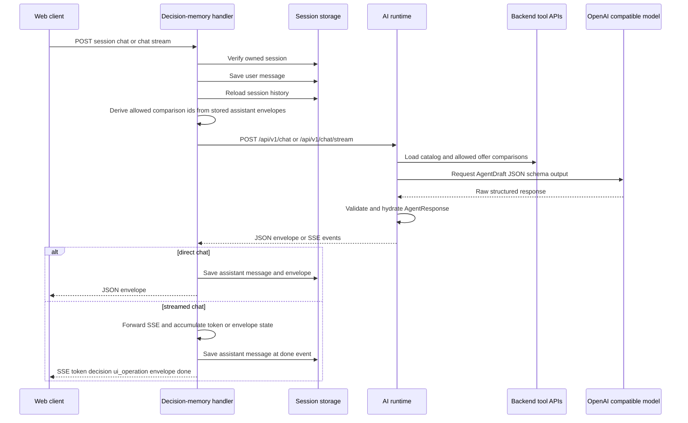
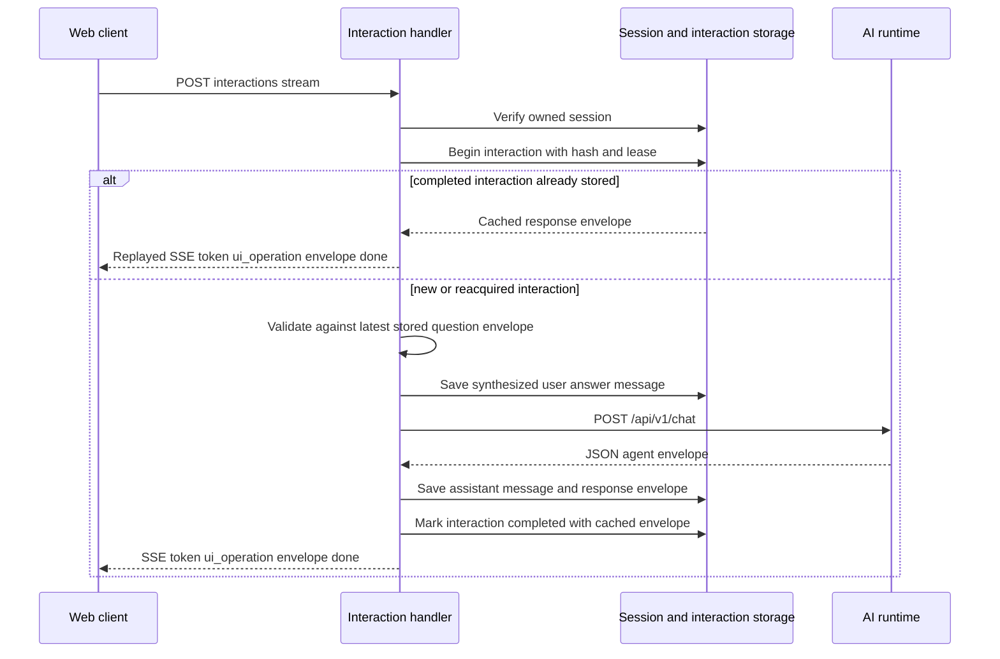
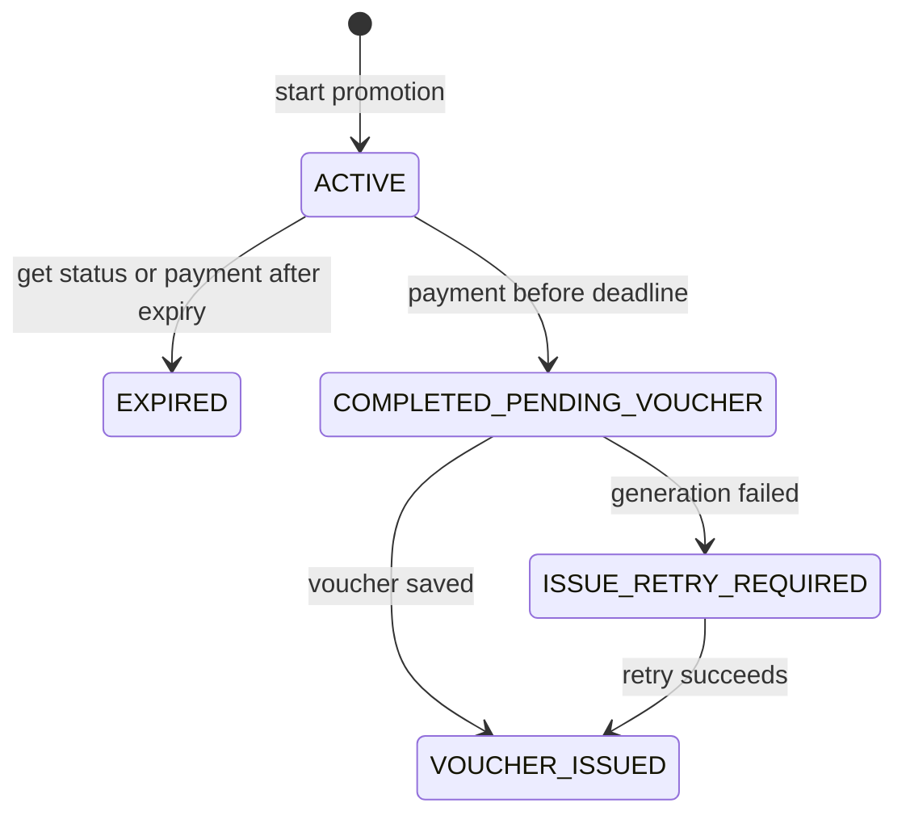

# Key End-to-End Workflows

This page follows the most important runtime flows that cross the web app, the Go backend, persistence, the Python AI runtime, and the promotion and resume-session modules. It focuses on where requests enter, where state is saved, where validation is enforced, how SSE is produced and transformed, and how failures are surfaced back to callers.

## Workflow map

The current system has five especially important end-to-end workflows:

1. **AI shopping conversation** through direct JSON chat and streamed chat.
2. **Clarification interaction replay** from a previously stored assistant question envelope.
3. **Checkout and order creation** with backend-authoritative validation and pricing.
4. **Resume-link recovery** from notification token to dashboard restoration.
5. **Checkout incentive lifecycle** from start to expiry or voucher issuance.

A key design rule across these workflows is that the **Go backend is the system of record** for session, order, resume-token, and promotion state, while the **AI runtime is a stateless model-serving process** that validates and generates structured responses.

## 1. AI shopping conversation

### Entry points and request shapes

The web client talks to decision-memory routes through `apps/web/src/api/decision-memory.ts`.

There are three distinct caller-visible modes:

- **Direct chat request**: `sendChatMessage()` posts to `POST /api/v1/sessions/{id}/chat` and expects one JSON envelope.
- **Streamed chat request**: `streamChatMessage()` posts to `POST /api/v1/sessions/{id}/chat/stream` and parses SSE into tokens, decision payloads, and the final envelope.
- **Interaction replay**: `sendInteractionStream()` posts a stored-question answer to `POST /api/v1/sessions/{id}/interactions/stream`; that flow is covered separately below because it has extra idempotency and validation rules.

The web client always sends JSON, adds `Authorization` when a token exists, and also ensures there is an `X-Anonymous-ID` header by creating and persisting an anonymous ID in `localStorage`.

### Direct chat and streamed chat sequence

```mermaid
sequenceDiagram
    participant Web as Web client
    participant DM as Decision-memory handler
    participant DB as Session storage
    participant AI as AI runtime
    participant Tools as Backend tool APIs
    participant LLM as OpenAI compatible model

    Web->>DM: POST session chat or chat stream
    DM->>DB: Verify owned session
    DM->>DB: Save user message
    DM->>DB: Reload session history
    DM->>DM: Derive allowed comparison ids from stored assistant envelopes
    DM->>AI: POST /api/v1/chat or /api/v1/chat/stream
    AI->>Tools: Load catalog and allowed offer comparisons
    AI->>LLM: Request AgentDraft JSON schema output
    LLM-->>AI: Raw structured response
    AI->>AI: Validate and hydrate AgentResponse
    AI-->>DM: JSON envelope or SSE events
    alt direct chat
        DM->>DB: Save assistant message and envelope
        DM-->>Web: JSON envelope
    else streamed chat
        DM->>DM: Forward SSE and accumulate token or envelope state
        DM->>DB: Save assistant message at done event
        DM-->>Web: SSE token decision ui_operation envelope done
    end
```
Caption: Direct chat and streamed chat share the same persisted-history and AI-runtime workflow, but they differ in transport and in where SSE is transformed.

### Backend responsibilities before AI is called

The Go decision-memory handler performs the same critical preparation for both `/chat` and `/chat/stream`:

- parse and validate the session ID
- verify that the caller owns the session
- bind the request body and require `message`
- persist the new user message immediately
- reload the full session from storage
- forward only `user` and `assistant` messages to the AI runtime
- derive `allowed_comparison_ids` by scanning stored assistant `ReasoningGraph` payloads for previously suggested product IDs

This means the AI runtime does **not** receive a client-authored transcript as source of truth. It receives a backend-reconstructed history from persisted session data.

### AI runtime responsibilities and validation

The Python runtime exposes `POST /api/v1/chat` and `POST /api/v1/chat/stream` under `/api/v1`.

For a chat request it:

- validates the request with Pydantic
- constructs a workflow with `create_workflow(...)`
- loads catalog data from backend tool endpoints
- loads offer-comparison data only for `allowed_comparison_ids`
- builds the system prompt from catalog, allowed IDs, and offer data
- calls the LLM with strict JSON-schema output for `AgentDraft`
- hydrates the result into a typed `AgentResponse`

If parsing or hydration fails, the workflow records the validation error and retries the LLM step up to `MAX_SELF_CORRECTION_RETRIES = 2`. If no valid `response` exists after the workflow, the API returns `502 invalid model response`. If the tool proxy fails with `httpx.HTTPError`, the chat endpoint returns `502 catalog unavailable`.

### Where SSE is created and where it is transformed

SSE exists in two layers:

1. **Created in the AI runtime**: `/api/v1/chat/stream` calls the normal chat endpoint, then `generate_agent_sse()` emits an ordered stream of:
   - `token`
   - optional decision event named `recommendation`, `comparison`, `offer_comparison`, or `checkout_ready`
   - zero or more `ui_operation` events
   - `envelope`
   - `done`
2. **Transformed in the Go backend**: the decision-memory `ChatStream` handler does not treat the response as opaque bytes. It scans SSE blocks, accumulates message text from `token` events, captures decision events, captures a full `envelope` when present, forwards the same blocks to the browser, and on `done` persists the assistant message.

If the runtime supplied a valid `envelope` event, the backend stores that exact envelope in `ReasoningGraph`. Otherwise it reconstructs a minimal envelope from the streamed message and decision event before saving.

The web client then performs a third layer of transformation: `readAgentSSE()` reads the streamed body, calls `onToken(...)` for `token` events, parses decision and `envelope` payloads with Zod, and returns either the streamed envelope or a locally reconstructed envelope when only token and decision events were seen.

### Persistence points

Conversation state is persisted in the Go backend, not the Python runtime:

- the **user message** is saved before contacting AI
- the **assistant message** is saved after successful direct response validation or at stream completion
- the full assistant envelope is stored as `ReasoningGraph`

This persistence model matters for later workflows because interaction replay and allowed comparison IDs both depend on previously stored assistant envelopes.

### Failure surfacing

Failure semantics differ by transport:

- **Direct chat**
  - invalid session ID or invalid JSON body returns `400`
  - AI transport failure returns `502 failed to connect to AI Runtime`
  - non-200 or invalid AI response returns `502`
  - assistant persistence failure returns `500 failed to save AI response`
- **Streamed chat**
  - setup failures before streaming begins return ordinary JSON HTTP errors
  - runtime-side stream failures are surfaced as SSE `error` followed by `done`
  - backend persistence failure after stream completion is also surfaced as SSE `error`
- **Web client**
  - `sendChatMessage()` throws `Agent request failed` on non-OK responses and `Invalid Agent response` on schema mismatch
  - `streamChatMessage()` throws `Agent request failed` if the HTTP response is non-OK, bodyless, or contains an SSE `error` event

## 2. Clarification interaction replay from stored question envelopes

This workflow is narrower than free-form chat. It exists specifically so the backend can validate a user's answer against the exact assistant question that was already persisted.

### Why this is a separate workflow

`POST /api/v1/sessions/{id}/interactions/stream` does not accept arbitrary client-generated interaction state. Instead, it reuses the latest stored assistant question envelope from session history, validates the user's answer against that envelope, converts the answer into a follow-up user message, and then re-enters the normal AI chat path.

### Interaction replay sequence

```mermaid
sequenceDiagram
    participant Web as Web client
    participant DM as Interaction handler
    participant DB as Session and interaction storage
    participant AI as AI runtime

    Web->>DM: POST interactions stream
    DM->>DB: Verify owned session
    DM->>DB: Begin interaction with hash and lease
    alt completed interaction already stored
        DB-->>DM: Cached response envelope
        DM-->>Web: Replayed SSE token ui_operation envelope done
    else new or reacquired interaction
        DM->>DM: Validate against latest stored question envelope
        DM->>DB: Save synthesized user answer message
        DM->>AI: POST /api/v1/chat
        AI-->>DM: JSON agent envelope
        DM->>DB: Save assistant message and response envelope
        DM->>DB: Mark interaction completed with cached envelope
        DM-->>Web: SSE token ui_operation envelope done
    end
```
Caption: Interaction replay turns a validated answer to a stored clarification question into a normal AI turn, with database-backed idempotency and cached response replay.

### Validation and idempotency

The interaction handler adds controls that do not exist on normal chat:

- caps request size at 16 KiB with `http.MaxBytesReader`
- requires `schema_version == "1.0"`, `event == "submit"`, and `action == "question.answer"`
- requires a valid UUID `interaction_id`
- hashes the entire request payload
- persists or locks a `(session_id, interaction_id)` work record with a 120 second lease

The backend then handles three important idempotency cases:

- **same interaction ID, different payload** → `409 interaction payload conflict`
- **same interaction ID, still pending under lease** → `409 interaction in progress` with `retryable: true`
- **same interaction ID, already completed** → return the stored `ResponseEnvelope` without calling AI again

### Validation against the stored question envelope

The handler searches backward through session messages for the latest assistant message that contains `ReasoningGraph`, then attempts to interpret it as a stored question envelope.

The request is rejected unless all of these match the active question:

- `interaction_id`
- `payload.question_id`
- `source_turn_id`
- `component_id`, either the question component itself or a component nested inside stored `ui_operations`

It also enforces:

- free text length must not exceed 1000 characters
- single-choice questions cannot submit more than one option
- selected option IDs must exist and be unique
- at least one answer must exist after combining selected options and trimmed free text

Only after that validation does the backend synthesize a natural-language message of the form `Answer to the clarification: ...` and feed it into `prepareAIChatPayload(...)`. That step reuses the normal conversation persistence and AI-request building logic.

### SSE behavior in replay

The interaction endpoint itself does **not** call the AI runtime's streaming endpoint. It calls `/api/v1/chat`, gets one full envelope, persists it, marks the interaction completed, and then converts that stored envelope into a browser-facing SSE stream with `writeEnvelopeSSE(...)`.

That synthetic stream emits:

- one `token` event containing the full assistant message
- zero or more `ui_operation` events from the stored envelope
- one `envelope` event
- one `done` event

So this workflow still looks like SSE to the browser, but the SSE is generated by the Go backend from a completed JSON envelope rather than forwarded live from the AI runtime.

### Failure surfacing

Interaction replay surfaces failures at several layers:

- unsupported interaction shape or envelope mismatch returns `400`
- idempotency conflicts return `409`
- AI failure or invalid AI response returns `502`
- assistant persistence failure returns `500`
- failure to mark the interaction completed after saving the assistant message returns `500`

The web helper maps `409` to `Interaction conflict` and other non-OK responses to `Agent request failed`.

## 3. Checkout and order creation

### Entry points

The order handler exposes two main runtime paths:

- `POST /api/v1/checkout` for order creation
- `GET /api/v1/orders` for listing a customer's orders

The create path is the more important end-to-end workflow because it is where validation, idempotency, and post-checkout promotion signaling happen.

### Create-order flow

The handler performs these steps in order:

1. Require an authenticated user unless development auth bypass is enabled.
2. Decode the request body with `json.Decoder`, reject unknown fields, and reject bodies containing more than one JSON object.
3. Validate the request struct through Gin binding.
4. Parse `customer_id` as a UUID.
5. In bypass mode, treat that customer ID as the authenticated identity.
6. Map request items into use-case inputs.
7. Pass the optional `Idempotency-Key` header into the order use case.
8. On success, optionally notify the promotion sink using the `X-Session-ID` header.
9. Return `201 Created` with the order payload.

The use case owns the deeper domain rules documented elsewhere, but from the handler boundary you can already see two important invariants:

- validation is backend-enforced before order creation logic runs
- the promotion lifecycle is triggered from successful checkout using the caller's session header, not inferred from browser state later

### Failure surfacing

Handler-level failures are exposed as follows:

- missing auth in normal mode returns unauthorized through shared app-error middleware
- invalid JSON, unknown fields, invalid customer UUID, or malformed query params return validation errors
- `OfferChangedError` becomes `409` with code `OFFER_CHANGED` and the refreshed authoritative offer snapshot
- `OfferUnavailableError` becomes `409` with code `OFFER_UNAVAILABLE`
- other use-case errors flow through shared error handling

This is the key client contract for retry behavior: if an external retailer offer changed, the backend returns the new authoritative offer details and requires the client to retry deliberately.

### Order listing

`GET /api/v1/orders` follows the same identity model:

- require auth unless development bypass is enabled
- if bypass is active and no auth exists, require `customer_id` query parameter
- parse `limit` and `offset`
- call the use case and return a paginated list

This is operationally important because the bypass path exists only when `CHECKOUT_AUTH_BYPASS=true` **and** `GIN_MODE=debug`.

## 4. Resume-link recovery

### User-visible flow

The web route `/resume` reads the `token` search parameter and calls `resumeSessionFromToken(token)`, which performs `GET /api/v1/session/resume?token=...`.

If the call succeeds, the route:

- removes the token from the URL
- invalidates React Query caches for `sessions` and the specific `session`
- navigates to `/dashboard?sessionId=...`

If the call fails, the route maps the backend error code into `ExpiredTokenUI`. Only `network_error` gets a manual retry button. Expired, consumed, and revoked tokens get a request-new-link path back to `/`.

### Backend validation and context hashing

The resume-session handler:

- requires a non-empty `token` query parameter
- computes a SHA-256 hash of `ClientIP + UserAgent`
- passes the raw token plus the optional context hash into the resume-session service
- maps domain errors into specific client-facing error codes and HTTP statuses

The handler returns:

- `400 token_missing` when the query parameter is absent
- `401 token_expired`
- `409 token_consumed`
- `401 token_revoked`
- `401 token_invalid` for other failures
- `200` with the restored session on success

The context hash is used as a risk signal during resume validation, not as a hard block. That preserves cross-device recovery while still allowing audit of context mismatch.

### Inactivity-notification side path

The same handler also exposes `POST /api/v1/session/:id/notify-inactivity`, which parses the session ID and calls `TriggerInactivityNotification(...)`. On success it returns a mocked message saying a Zalo notification was sent.

The runtime significance is that resume-link recovery is split into two phases:

- **token issuance and notification dispatch** from the backend
- **token consumption and session restoration** through `/session/resume`

## 5. Checkout incentive lifecycle

### Start and status endpoints

The promotions handler registers:

- `POST /api/v1/checkout-incentive/start`
- `GET /api/v1/checkout-incentive/status`

Both workflows are keyed by `X-Session-ID`. Start additionally accepts optional `X-User-ID` and `X-Device-ID`, and it refuses requests that provide neither user nor device identity.

The current web feature uses the locally stored anonymous ID for both `X-Session-ID` and `X-Device-ID` when calling these endpoints.

### Service lifecycle and invariants

The promotion service enforces these lifecycle rules:

- starting a promotion is **idempotent per session**; if a promotion already exists for the same session, it is returned as-is
- before creating a new promotion for a different session, eligibility is checked across prior promotions for the same user or device
- if `CooldownUntil` is still in the future, start fails with a conflict
- new promotions default to `ACTIVE`, expire after 15 minutes, and set a 30 day cooldown
- `GetStatus` lazily flips `ACTIVE` to `EXPIRED` when backend time has passed `ExpiresAt`
- `HandlePaymentCompleted` is the checkout hook that decides whether voucher issuance is still allowed
- payment after expiry results in no voucher and, if still active, status update to `EXPIRED`
- payment before expiry moves the promotion to `COMPLETED_PENDING_VOUCHER` and attempts voucher issuance
- voucher-generation failure updates status to `ISSUE_RETRY_REQUIRED`
- explicit retry is only allowed from `ISSUE_RETRY_REQUIRED`

```mermaid
stateDiagram-v2
    [*] --> ACTIVE: start promotion
    ACTIVE --> EXPIRED: get status or payment after expiry
    ACTIVE --> COMPLETED_PENDING_VOUCHER: payment before deadline
    COMPLETED_PENDING_VOUCHER --> VOUCHER_ISSUED: voucher saved
    COMPLETED_PENDING_VOUCHER --> ISSUE_RETRY_REQUIRED: generation failed
    ISSUE_RETRY_REQUIRED --> VOUCHER_ISSUED: retry succeeds
```
Caption: Checkout incentives are session-scoped, cooldown-limited promotions whose reward eligibility is decided by backend time at payment completion.

### Checkout integration point

Order creation is where this lifecycle reconnects to the commerce flow. After a successful checkout, the order handler looks for `X-Session-ID` and, if a promotion sink is configured, calls `HandlePaymentCompleted(context.Background(), sessionID)`.

That means the incentive system is not merely a frontend timer. Reward issuance depends on a backend callback from the completed order path.

### Failure surfacing

At the HTTP boundary:

- start returns `400` for invalid payloads or missing session or identity headers
- start returns `409` when cooldown or other eligibility logic rejects the promotion
- status returns `400` when `X-Session-ID` is missing
- status returns `404` when no promotion exists for that session
- status returns `500` on service failure

On the web side, the feature maps `404` to a local `not_found` error and `409` during start to `conflict`.

## Cross-workflow persistence and ownership summary

The important state owners are:

- **decision-memory storage**: sessions, ordered messages, stored assistant envelopes, and leased interaction records
- **orders storage**: created checkout orders and their authoritative backend snapshot
- **resume-session storage**: hashed resume tokens, revocation or consumption state, and notification logs
- **promotions storage**: checkout promotion status, expiry, cooldown, and voucher result
- **AI runtime**: no durable conversation ownership; it validates, enriches, and streams structured responses

This ownership split explains several seemingly redundant behaviors in code: the backend saves user and assistant messages even when the AI runtime already produced the answer, and the interaction replay flow validates against stored envelopes instead of trusting the browser.

## Operational watch-outs

- Keep the backend and AI runtime paths aligned on the `/api/v1` prefix; the Go chat handlers currently target `/api/v1/chat` and `/api/v1/chat/stream`.
- When debugging streamed chat, distinguish three layers: runtime SSE generation, backend SSE forwarding and persistence, and web SSE parsing.
- Do not weaken interaction validation without updating the stored-envelope and idempotency model together.
- Remember that checkout auth bypass is only active in debug mode even if `CHECKOUT_AUTH_BYPASS=true` is set.
- Promotion expiry and resume-token validity are enforced by backend time and backend state, not by browser timers.
