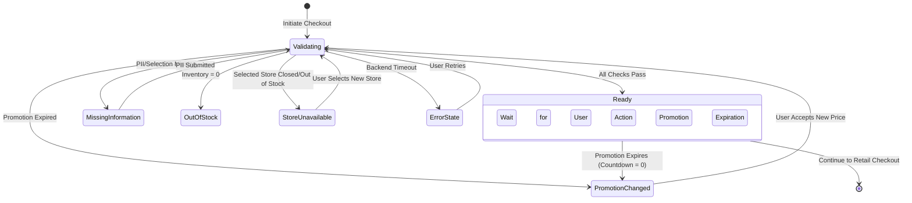

# Data Model: Checkout Readiness

## Overview

The Checkout Readiness feature introduces states and entities that span the Go Backend (Decision Memory), Python AI Runtime, and React Frontend.

## Domain Model

### 1. CheckoutReadinessState
Represents the overarching readiness evaluation for the current session.

- `sessionId` (String): UUID of the active shopping session.
- `cartVersion` (String): Hash or version ID of the cart to detect concurrent updates.
- `status` (Enum): `READY`, `MISSING_INFORMATION`, `INVENTORY_CHANGED`, `PROMOTION_CHANGED`, `OUT_OF_STOCK`, `STORE_UNAVAILABLE`, `REQUIRES_USER_ACTION`.
- `lastValidatedAt` (Timestamp): When the Retail Backend last confirmed the data.
- `validationChecklist` (List<ValidationItem>): Details of what passed/failed.
- `productSnapshot` (ProductSnapshot): The locked-in product details at the time of validation.
- `customerProfile` (CustomerProfile): The customer's information.

### 2. ValidationItem
Represents a single rule checked during the assessment.

- `type` (Enum): `INVENTORY`, `PRICE`, `PROMOTION`, `CUSTOMER_INFO`, `STORE_AVAILABILITY`.
- `passed` (Boolean): True if the check passed.
- `message` (String): Human-readable reason for failure (e.g., "The selected store is closed today.").

### 3. CustomerProfile
Stores the user's progress toward checkout readiness. Persisted securely in Decision Memory.

- `name` (String, Optional): First and Last Name.
- `phoneNumber` (String, Optional): E.164 format or standard VN 10-digit format.
- `deliveryPreference` (Enum): `HOME_DELIVERY`, `STORE_PICKUP`, `UNSELECTED`.
- `deliveryAddress` (Object, Optional): Contains Street, City, District, Ward. Required if `HOME_DELIVERY`.
- `selectedStore` (Store, Optional): Required if `STORE_PICKUP`.

### 4. PromotionContext
Details the active promotions affecting the readiness state.

- `promotionId` (String): ID from the Retail Backend.
- `description` (String): User-facing description (e.g., "Flash Sale: 10% Off").
- `discountAmountVnd` (Integer): The amount deducted.
- `expiresAt` (Timestamp, Optional): Absolute expiration time for the countdown.

## State Model

The state transitions occur primarily in the Go Backend based on semantic events or time expirations, and dictate the UI rendered by the AI Runtime.

