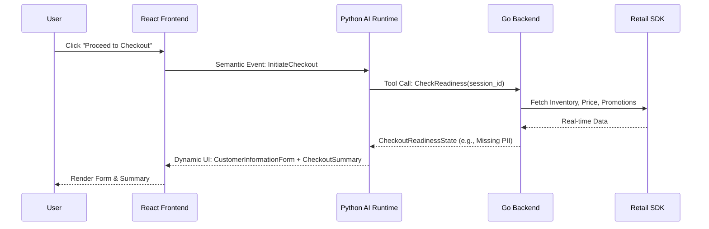

# Research & Architecture Decisions: Checkout Readiness

## Overview

The Checkout Readiness feature bridges the gap between conversational product discovery and the retailer's traditional checkout system. The AI Sales Agent orchestrates a validation sequence using the Dynamic UI Protocol to ensure all prerequisites are met before handoff.

## Architecture Decisions

### 1. Separation of Concerns (AG-UI Inspired)
- **Decision**: The AI Runtime will output declarative Dynamic UI schemas (e.g., `CheckoutSummary`, `CustomerInformationForm`). The Frontend React application will render these components natively.
- **Rationale**: Adheres to the Declarative UI principle. The AI is responsible for the intent to collect PII or display a promotion countdown, but the frontend controls the rendering and secure data transmission.

### 2. PII Collection Bypasses AI Memory
- **Decision**: PII (Name, Phone, Address) collected via the `CustomerInformationForm` is submitted directly to the Go Backend API. The backend returns a semantic event (e.g., `PiiCollected { status: "success" }`) to the AI Runtime.
- **Rationale**: Complies with the Constitution's least-privilege principle. The AI remains stateless and does not record sensitive user data in its conversation history.

### 3. Promotional Countdown Management
- **Decision**: The Retail Backend provides an absolute `expiresAt` timestamp. The React frontend computes the remaining time and triggers a semantic `PromotionExpired` event when the countdown reaches zero.
- **Rationale**: Ensures the countdown persists accurately across sessions. The frontend handles the real-time ticking, avoiding constant backend polling, while the backend remains the source of truth for the expiration time.

### 4. Hybrid Geolocation for Store Pickup
- **Decision**: The `StorePicker` component will first attempt to use the HTML5 Geolocation API. If successful, it calls the backend `/api/stores/nearby` endpoint. If denied, it displays a manual city/district search form.
- **Rationale**: Optimizes the UX for mobile and location-aware devices while maintaining a robust fallback for privacy-conscious users.

## Workflows and Flows

### 1. Validation Flow
1. User clicks "Checkout" in Product Comparison.
2. AI Runtime issues a `ValidateCheckoutReadiness` tool call to the Go Backend.
3. Backend checks Inventory, Pricing, Promotions, and Warranty.
4. Backend returns the `CheckoutReadinessState`.
5. AI analyzes the state and generates the `CheckoutSummary` Dynamic UI.

### 2. Customer Information Flow
1. If the state is `Missing Information`, AI generates a `CustomerInformationForm` UI.
2. User submits the form.
3. React posts data to Go Backend securely.
4. Backend updates Decision Memory and emits `CustomerInfoUpdated` event to AI.
5. AI confirms via chat and updates the UI.

### 3. Promotion Countdown Flow
1. Go Backend identifies an active promotion with an `expiresAt` timestamp.
2. AI generates `PromotionSummary` with the countdown parameters.
3. React renders a ticking countdown.
4. Timer hits 0 -> React emits `PromotionExpired` semantic event.
5. Backend auto-revalidates and pushes updated prices to AI.
6. AI updates UI to `Promotion Changed` state.

## Sequence Diagram: Checkout Assessment

## AG-UI Compatibility Mapping

| AG-UI Concept | Checkout Readiness Implementation |
|---------------|-----------------------------------|
| Declarative UI | AI outputs `type: "CustomerInformationForm"`, not HTML forms. |
| Event-driven | Frontend emits `StoreSelected`, `FormSubmitted` semantic events. |
| Incremental Updates | When a promotion expires, only the `PromotionSummary` and Price are patched. |
| Streaming | AI explains validation errors (e.g., "The item is out of stock") via streaming text while rendering the Error State UI. |
