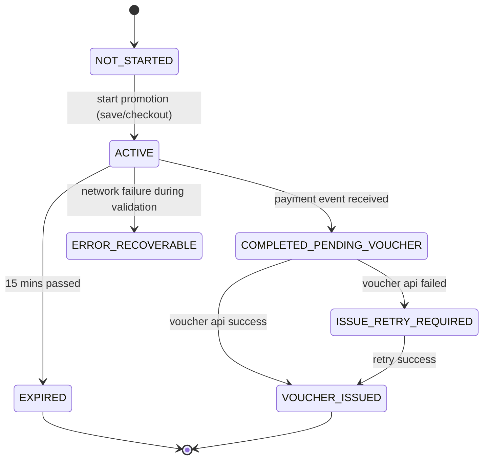
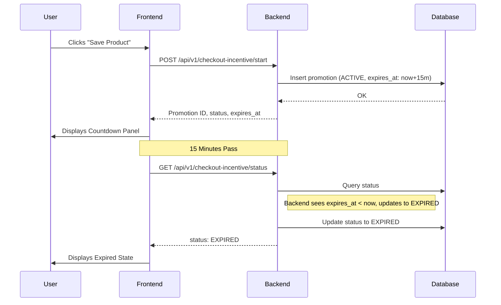
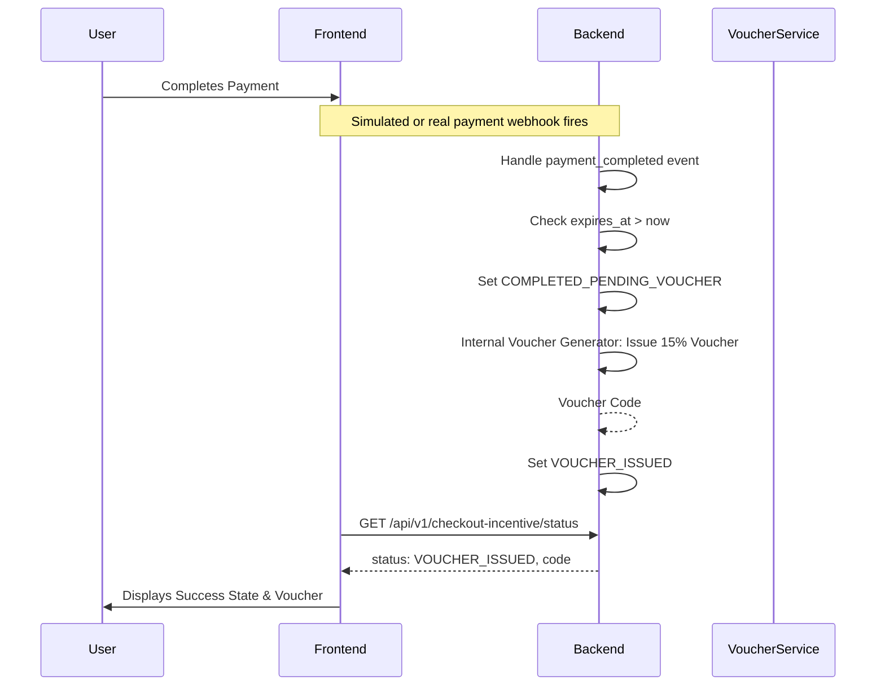

# Technical Implementation Plan: Checkout Incentive Countdown

## Technical Context
- **Frontend**: React 19, Vite, TypeScript, TanStack Query, Tailwind CSS v4.
- **Backend**: Go, Gin, GORM, PostgreSQL.
- **AI Runtime**: Python, FastAPI, LangGraph (No changes required for this feature).
- **Constraints**: No Kafka, Redis, queues, cron jobs, microservices, payment implementation, or AI changes.

## Constitution Check
- **Component-First Architecture**: `CheckoutIncentivePanel` will be built as an isolated component under the feature's `components/` directory in `apps/web`.
- **Performance First**: The UI will check the backend status periodically using TanStack Query, rather than a raw `setInterval` doing constant network calls.
- **Type-Safe Code**: The API contracts will be defined in `packages/api-types` to ensure strict typing between Go and React.
- **Dark-First Premium Design**: The panel will adhere to Tailwind v4 theme guidelines and smooth CSS transitions.

## Architecture

The system utilizes an event-driven flow triggered from the client, backed by strict server-side state enforcement to prevent manipulation of the countdown.

### Promotion Lifecycle (State Machine)

### Sequence Diagram: Activation and Expiration

### Sequence Diagram: Successful Completion

## Implementation Phases

### Phase 1: Database & Data Model
- Define the `checkout_promotions` table schema in PostgreSQL.
- Create the GORM model `CheckoutPromotion` in `apps/server/internal/promotions/repository`.
- Implement basic CRUD operations (Create, FindBySession, UpdateStatus).

### Phase 2: Backend API & State Logic
- Implement API types in `packages/api-types` for the start, status, and webhook payloads.
- Create the `promotions` service in Go Gin (`apps/server/internal/promotions/service.go`).
- Implement `StartPromotion`, enforcing idempotency and the cooldown period.
- Implement the `Status` endpoint, ensuring it lazily transitions `ACTIVE` to `EXPIRED` if `expires_at` is surpassed when queried.
- Implement the internal payment webhook handler to transition to `COMPLETED_PENDING_VOUCHER` and trigger issuance.
- Implement voucher issuance locally inside the Go backend. It generates the code, persists it, enforces exactly-once issuance, and exposes an internal interface (allowing future external provider replacement without changing business logic).
- Implement the dev-only simulate payment endpoint.

### Phase 3: Frontend UI Components
- Build `CheckoutIncentivePanel`, `CountdownDisplay`, and `PromotionBadge` in `apps/web/src/features/checkout-incentive/components`.
- Implement responsive design (floating panel on desktop, bottom sheet on mobile).
- Ensure strict adherence to WCAG accessibility (aria-live regions for time updates, keyboard nav).
- Add TanStack Query hooks to fetch the promotion status and update the UI context.

### Phase 4: Integration & End-to-End Validation
- Implement `CheckoutIncentiveProvider` and `useCheckoutIncentive` hook to expose `startPromotion(triggerType)` and state. Render the provider and panel at the layout level, allowing nested Save/Checkout components to invoke the hook directly without a global event bus.
- Implement the retry mechanism for `ISSUE_RETRY_REQUIRED`.
- Test refresh continuity and session consistency.
- Validate via `quickstart.md` scenarios.
